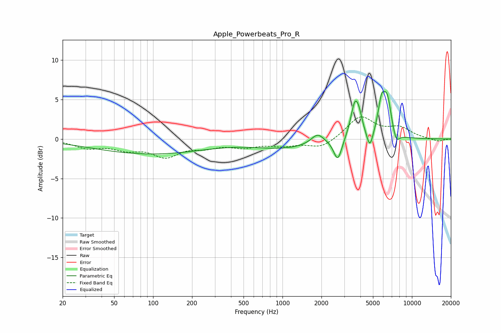

# Apple_Powerbeats_Pro_R
See [usage instructions](https://github.com/jaakkopasanen/AutoEq#usage) for more options and info.

### Parametric EQs
Apply preamp of -6.1 dB when using parametric equalizer.

|   # | Type    |   Fc (Hz) |    Q |   Gain (dB) |
|-----|---------|-----------|------|-------------|
|   1 | Peaking |        94 | 0.32 |        -1.9 |
|   2 | Peaking |      1031 | 0.62 |        -1.1 |
|   3 | Peaking |      1865 | 2.93 |         1.3 |
|   4 | Peaking |      2674 | 4.48 |        -2.8 |
|   5 | Peaking |      3625 | 4.34 |         4.4 |
|   6 | Peaking |      3926 | 5.63 |         1.4 |
|   7 | Peaking |      4731 | 5.95 |        -2.2 |
|   8 | Peaking |      5811 | 5.22 |         3.6 |
|   9 | Peaking |      6448 | 4.19 |         4.6 |
|  10 | Peaking |      7543 | 5.05 |        -1.5 |

### Fixed Band EQs
When using fixed band (also called graphic) equalizer, apply preamp of **-2.9 dB** (if available) and set gains manually with these parameters.

|   # | Type    |   Fc (Hz) |    Q |   Gain (dB) |
|-----|---------|-----------|------|-------------|
|   1 | Peaking |        31 | 1.41 |        -1   |
|   2 | Peaking |        62 | 1.41 |        -1.1 |
|   3 | Peaking |       125 | 1.41 |        -2   |
|   4 | Peaking |       250 | 1.41 |        -0.8 |
|   5 | Peaking |       500 | 1.41 |        -0.9 |
|   6 | Peaking |      1000 | 1.41 |        -0.7 |
|   7 | Peaking |      2000 | 1.41 |        -1.2 |
|   8 | Peaking |      4000 | 1.41 |         2.8 |
|   9 | Peaking |      8000 | 1.41 |         1.3 |
|  10 | Peaking |     16000 | 1.41 |        -0.3 |

### Graphs

