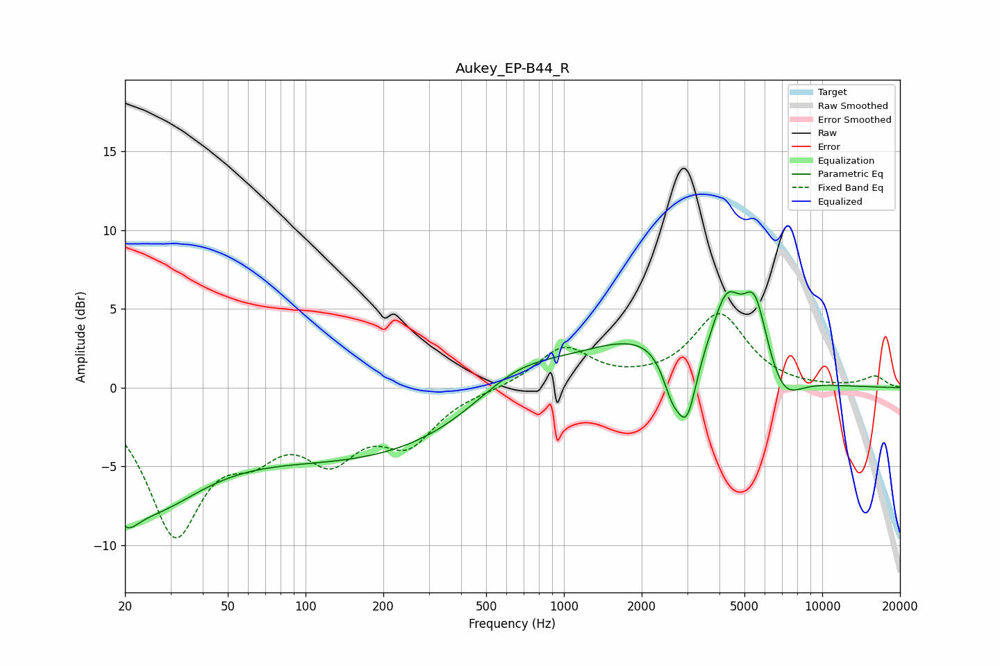

# Aukey_EP-B44_R
See [usage instructions](https://github.com/jaakkopasanen/AutoEq#usage) for more options and info.

### Parametric EQs
Apply preamp of -6.2 dB when using parametric equalizer.

|   # | Type    |   Fc (Hz) |    Q |   Gain (dB) |
|-----|---------|-----------|------|-------------|
|   1 | Peaking |        20 | 2.84 |        -2.1 |
|   2 | Peaking |        24 | 0.64 |        -6.4 |
|   3 | Peaking |       170 | 0.27 |        -4.4 |
|   4 | Peaking |       651 | 0.77 |         2.4 |
|   5 | Peaking |      2085 | 0.54 |         3.2 |
|   6 | Peaking |      2623 | 3.63 |        -2.4 |
|   7 | Peaking |      2997 | 3.62 |        -4.2 |
|   8 | Peaking |      4269 | 2.58 |         3.8 |
|   9 | Peaking |      5485 | 2.81 |         4.5 |
|  10 | Peaking |      7041 | 1.95 |        -2   |

### Fixed Band EQs
When using fixed band (also called graphic) equalizer, apply preamp of **-4.8 dB** (if available) and set gains manually with these parameters.

|   # | Type    |   Fc (Hz) |    Q |   Gain (dB) |
|-----|---------|-----------|------|-------------|
|   1 | Peaking |        31 | 1.41 |        -8.9 |
|   2 | Peaking |        62 | 1.41 |        -2.8 |
|   3 | Peaking |       125 | 1.41 |        -3.7 |
|   4 | Peaking |       250 | 1.41 |        -3.1 |
|   5 | Peaking |       500 | 1.41 |        -0.1 |
|   6 | Peaking |      1000 | 1.41 |         2.5 |
|   7 | Peaking |      2000 | 1.41 |         0.2 |
|   8 | Peaking |      4000 | 1.41 |         4.6 |
|   9 | Peaking |      8000 | 1.41 |        -0   |
|  10 | Peaking |     16000 | 1.41 |         0.7 |

### Graphs

