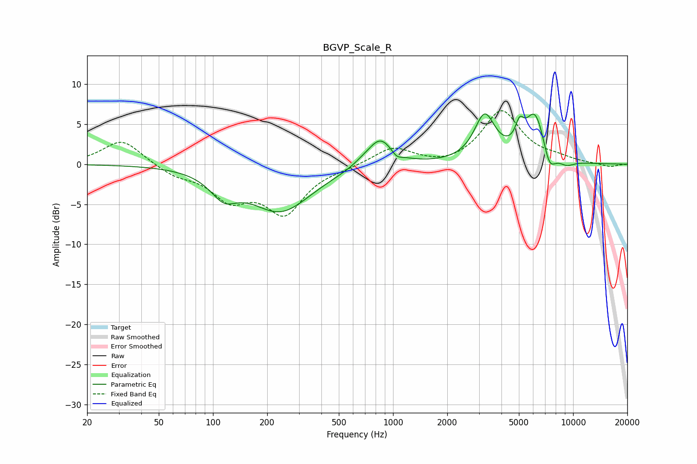

# BGVP_Scale_R
See [usage instructions](https://github.com/jaakkopasanen/AutoEq#usage) for more options and info.

### Parametric EQs
Apply preamp of -6.4 dB when using parametric equalizer.

|   # | Type    |   Fc (Hz) |    Q |   Gain (dB) |
|-----|---------|-----------|------|-------------|
|   1 | Peaking |       115 | 1.91 |        -2.7 |
|   2 | Peaking |       237 | 0.82 |        -5.8 |
|   3 | Peaking |       668 | 2.72 |         0.3 |
|   4 | Peaking |       848 | 1.98 |         3.6 |
|   5 | Peaking |      1046 | 4.78 |        -0.8 |
|   6 | Peaking |      3229 | 2.45 |         5.7 |
|   7 | Peaking |      5044 | 6    |         2.3 |
|   8 | Peaking |      6161 | 2.34 |         6.3 |
|   9 | Peaking |      7372 | 3.88 |        -2.9 |
|  10 | Peaking |      9176 | 2.81 |        -0.8 |

### Fixed Band EQs
When using fixed band (also called graphic) equalizer, apply preamp of **-6.8 dB** (if available) and set gains manually with these parameters.

|   # | Type    |   Fc (Hz) |    Q |   Gain (dB) |
|-----|---------|-----------|------|-------------|
|   1 | Peaking |        31 | 1.41 |         3.1 |
|   2 | Peaking |        62 | 1.41 |        -1.2 |
|   3 | Peaking |       125 | 1.41 |        -3.9 |
|   4 | Peaking |       250 | 1.41 |        -5.8 |
|   5 | Peaking |       500 | 1.41 |        -0.3 |
|   6 | Peaking |      1000 | 1.41 |         2.1 |
|   7 | Peaking |      2000 | 1.41 |        -0.4 |
|   8 | Peaking |      4000 | 1.41 |         6.6 |
|   9 | Peaking |      8000 | 1.41 |         0.6 |
|  10 | Peaking |     16000 | 1.41 |        -0.4 |

### Graphs

