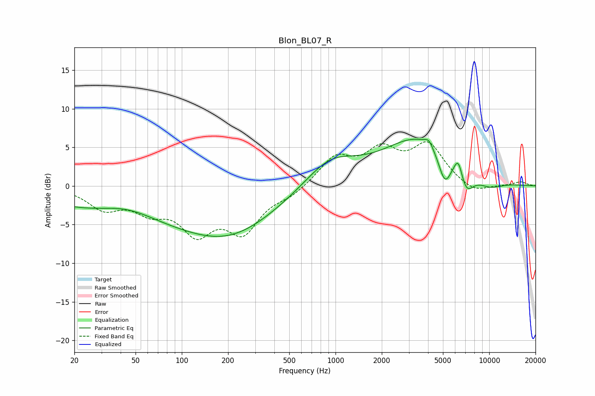

# Blon_BL07_R
See [usage instructions](https://github.com/jaakkopasanen/AutoEq#usage) for more options and info.

### Parametric EQs
Apply preamp of -6.2 dB when using parametric equalizer.

|   # | Type    |   Fc (Hz) |    Q |   Gain (dB) |
|-----|---------|-----------|------|-------------|
|   1 | Peaking |        44 | 0.77 |         1.8 |
|   2 | Peaking |        77 | 0.18 |        -4.7 |
|   3 | Peaking |       206 | 0.53 |        -2.8 |
|   4 | Peaking |       921 | 0.86 |         3.5 |
|   5 | Peaking |      3537 | 0.59 |         6.2 |
|   6 | Peaking |      4048 | 5.45 |         0.9 |
|   7 | Peaking |      5141 | 3.28 |        -3.9 |
|   8 | Peaking |      6293 | 4.81 |         2.5 |
|   9 | Peaking |      7057 | 2.74 |        -3.2 |
|  10 | Peaking |     10000 | 1.36 |        -1.2 |

### Fixed Band EQs
When using fixed band (also called graphic) equalizer, apply preamp of **-5.8 dB** (if available) and set gains manually with these parameters.

|   # | Type    |   Fc (Hz) |    Q |   Gain (dB) |
|-----|---------|-----------|------|-------------|
|   1 | Peaking |        31 | 1.41 |        -2.7 |
|   2 | Peaking |        62 | 1.41 |        -2.6 |
|   3 | Peaking |       125 | 1.41 |        -5.3 |
|   4 | Peaking |       250 | 1.41 |        -5.4 |
|   5 | Peaking |       500 | 1.41 |        -1.1 |
|   6 | Peaking |      1000 | 1.41 |         3.5 |
|   7 | Peaking |      2000 | 1.41 |         4.1 |
|   8 | Peaking |      4000 | 1.41 |         5   |
|   9 | Peaking |      8000 | 1.41 |        -1.1 |
|  10 | Peaking |     16000 | 1.41 |         0.5 |

### Graphs

