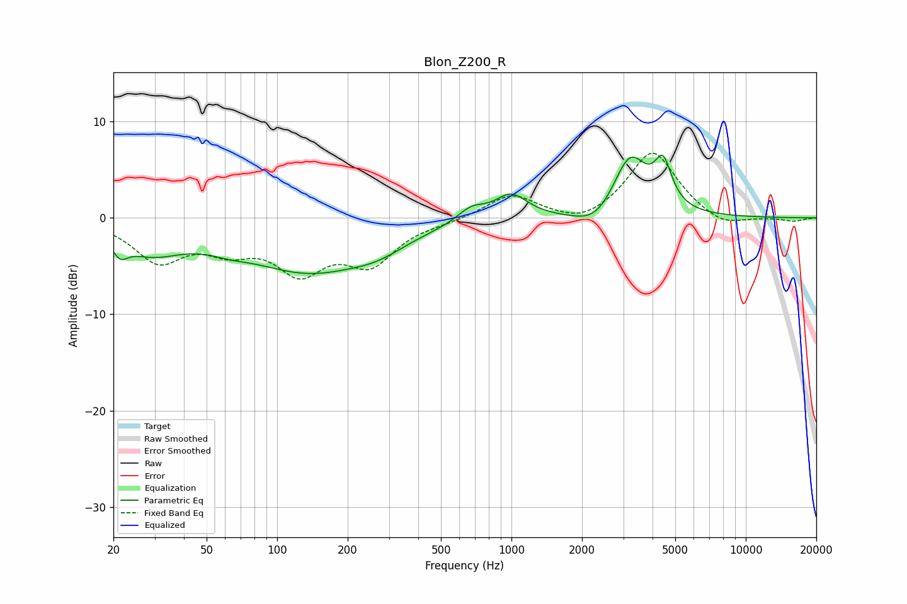

# Blon_Z200_R
See [usage instructions](https://github.com/jaakkopasanen/AutoEq#usage) for more options and info.

### Parametric EQs
Apply preamp of -6.6 dB when using parametric equalizer.

|   # | Type    |   Fc (Hz) |    Q |   Gain (dB) |
|-----|---------|-----------|------|-------------|
|   1 | Peaking |        21 | 4.5  |        -1.6 |
|   2 | Peaking |        29 | 1    |        -3   |
|   3 | Peaking |        62 | 1.58 |        -0.7 |
|   4 | Peaking |       137 | 0.53 |        -5.3 |
|   5 | Peaking |       270 | 1.18 |        -1.2 |
|   6 | Peaking |       672 | 2.4  |         1.4 |
|   7 | Peaking |       996 | 2    |         2.5 |
|   8 | Peaking |      2288 | 1.66 |        -1.8 |
|   9 | Peaking |      3206 | 1.9  |         6.4 |
|  10 | Peaking |      4439 | 3.88 |         4.3 |

### Fixed Band EQs
When using fixed band (also called graphic) equalizer, apply preamp of **-6.8 dB** (if available) and set gains manually with these parameters.

|   # | Type    |   Fc (Hz) |    Q |   Gain (dB) |
|-----|---------|-----------|------|-------------|
|   1 | Peaking |        31 | 1.41 |        -4.2 |
|   2 | Peaking |        62 | 1.41 |        -2.5 |
|   3 | Peaking |       125 | 1.41 |        -4.9 |
|   4 | Peaking |       250 | 1.41 |        -4.3 |
|   5 | Peaking |       500 | 1.41 |        -0.3 |
|   6 | Peaking |      1000 | 1.41 |         2.5 |
|   7 | Peaking |      2000 | 1.41 |        -1.1 |
|   8 | Peaking |      4000 | 1.41 |         7   |
|   9 | Peaking |      8000 | 1.41 |        -1.1 |
|  10 | Peaking |     16000 | 1.41 |        -0.4 |

### Graphs

