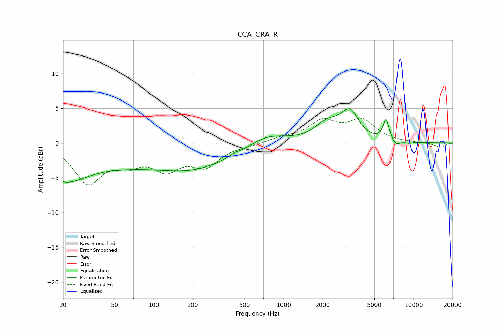

# CCA_CRA_R
See [usage instructions](https://github.com/jaakkopasanen/AutoEq#usage) for more options and info.

### Parametric EQs
Apply preamp of -5.1 dB when using parametric equalizer.

|   # | Type    |   Fc (Hz) |    Q |   Gain (dB) |
|-----|---------|-----------|------|-------------|
|   1 | Peaking |        20 | 0.88 |        -3.6 |
|   2 | Peaking |        85 | 0.19 |        -3.2 |
|   3 | Peaking |       207 | 0.65 |        -1.2 |
|   4 | Peaking |       419 | 5.9  |         0.2 |
|   5 | Peaking |       749 | 0.99 |         1.6 |
|   6 | Peaking |      2189 | 1.43 |         2.6 |
|   7 | Peaking |      3242 | 2.12 |         3.8 |
|   8 | Peaking |      6148 | 5.96 |         3.1 |
|   9 | Peaking |      7295 | 4.11 |        -0.8 |
|  10 | Peaking |      9254 | 5.01 |        -0.2 |

### Fixed Band EQs
When using fixed band (also called graphic) equalizer, apply preamp of **-3.7 dB** (if available) and set gains manually with these parameters.

|   # | Type    |   Fc (Hz) |    Q |   Gain (dB) |
|-----|---------|-----------|------|-------------|
|   1 | Peaking |        31 | 1.41 |        -5.5 |
|   2 | Peaking |        62 | 1.41 |        -2.3 |
|   3 | Peaking |       125 | 1.41 |        -3.3 |
|   4 | Peaking |       250 | 1.41 |        -3   |
|   5 | Peaking |       500 | 1.41 |        -0.3 |
|   6 | Peaking |      1000 | 1.41 |         0.6 |
|   7 | Peaking |      2000 | 1.41 |         2.9 |
|   8 | Peaking |      4000 | 1.41 |         3   |
|   9 | Peaking |      8000 | 1.41 |         0   |
|  10 | Peaking |     16000 | 1.41 |        -0.6 |

### Graphs

