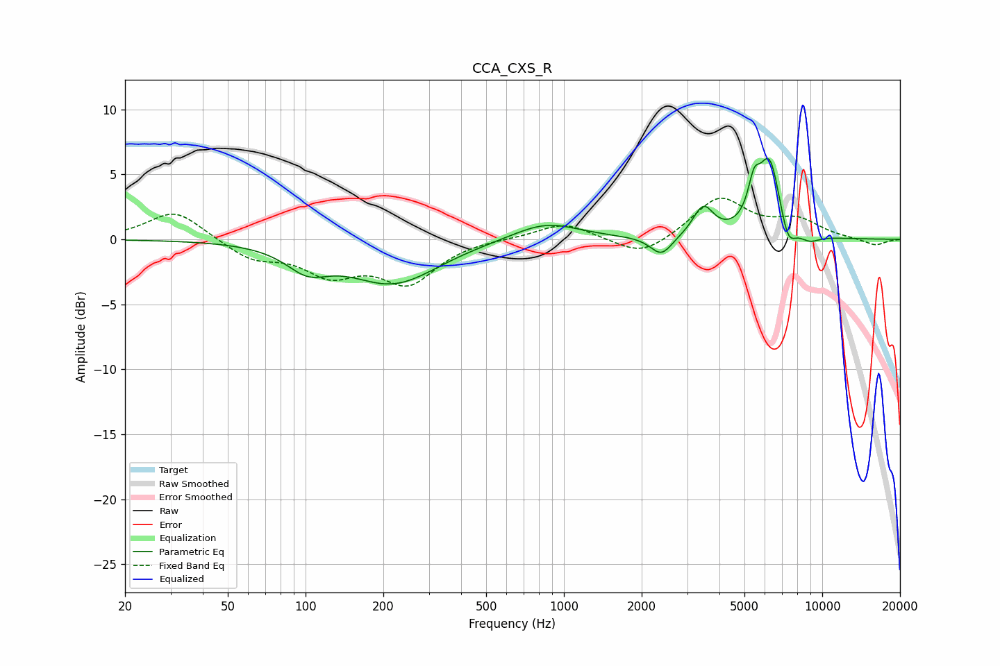

# CCA_CXS_R
See [usage instructions](https://github.com/jaakkopasanen/AutoEq#usage) for more options and info.

### Parametric EQs
Apply preamp of -6.3 dB when using parametric equalizer.

|   # | Type    |   Fc (Hz) |    Q |   Gain (dB) |
|-----|---------|-----------|------|-------------|
|   1 | Peaking |       102 | 1.72 |        -1.7 |
|   2 | Peaking |       217 | 0.82 |        -3.3 |
|   3 | Peaking |       298 | 1.63 |        -0   |
|   4 | Peaking |       850 | 1.09 |         1.4 |
|   5 | Peaking |      2386 | 3.33 |        -1.5 |
|   6 | Peaking |      3463 | 3.54 |         2.3 |
|   7 | Peaking |      5443 | 6    |         2.5 |
|   8 | Peaking |      6253 | 3.13 |         6.1 |
|   9 | Peaking |      7356 | 4.52 |        -2.1 |
|  10 | Peaking |      8925 | 3.22 |        -0.6 |

### Fixed Band EQs
When using fixed band (also called graphic) equalizer, apply preamp of **-3.3 dB** (if available) and set gains manually with these parameters.

|   # | Type    |   Fc (Hz) |    Q |   Gain (dB) |
|-----|---------|-----------|------|-------------|
|   1 | Peaking |        31 | 1.41 |         2.3 |
|   2 | Peaking |        62 | 1.41 |        -1.4 |
|   3 | Peaking |       125 | 1.41 |        -2.4 |
|   4 | Peaking |       250 | 1.41 |        -3.2 |
|   5 | Peaking |       500 | 1.41 |         0.1 |
|   6 | Peaking |      1000 | 1.41 |         1.3 |
|   7 | Peaking |      2000 | 1.41 |        -1.5 |
|   8 | Peaking |      4000 | 1.41 |         3.2 |
|   9 | Peaking |      8000 | 1.41 |         1.3 |
|  10 | Peaking |     16000 | 1.41 |        -0.5 |

### Graphs

