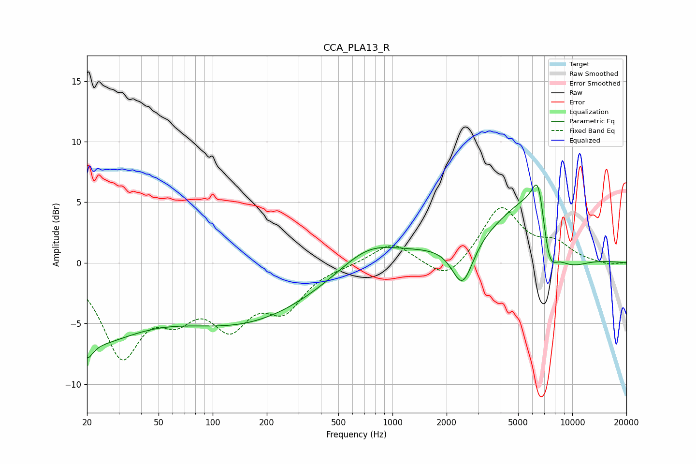

# CCA_PLA13_R
See [usage instructions](https://github.com/jaakkopasanen/AutoEq#usage) for more options and info.

### Parametric EQs
Apply preamp of -6.5 dB when using parametric equalizer.

|   # | Type    |   Fc (Hz) |    Q |   Gain (dB) |
|-----|---------|-----------|------|-------------|
|   1 | Peaking |        20 | 4.57 |        -1.4 |
|   2 | Peaking |        20 | 0.49 |        -5.8 |
|   3 | Peaking |       146 | 0.35 |        -4.7 |
|   4 | Peaking |       729 | 0.88 |         1.9 |
|   5 | Peaking |      2452 | 2.37 |        -3.9 |
|   6 | Peaking |      2797 | 0.41 |         1   |
|   7 | Peaking |      6364 | 0.75 |         6.4 |
|   8 | Peaking |      6492 | 3.91 |         3.7 |
|   9 | Peaking |      7408 | 2.94 |        -3.9 |
|  10 | Peaking |      8926 | 0.96 |        -3.8 |

### Fixed Band EQs
When using fixed band (also called graphic) equalizer, apply preamp of **-4.6 dB** (if available) and set gains manually with these parameters.

|   # | Type    |   Fc (Hz) |    Q |   Gain (dB) |
|-----|---------|-----------|------|-------------|
|   1 | Peaking |        31 | 1.41 |        -7.2 |
|   2 | Peaking |        62 | 1.41 |        -3.2 |
|   3 | Peaking |       125 | 1.41 |        -4.4 |
|   4 | Peaking |       250 | 1.41 |        -3.4 |
|   5 | Peaking |       500 | 1.41 |        -0.1 |
|   6 | Peaking |      1000 | 1.41 |         1.7 |
|   7 | Peaking |      2000 | 1.41 |        -1.7 |
|   8 | Peaking |      4000 | 1.41 |         4.6 |
|   9 | Peaking |      8000 | 1.41 |         1.4 |
|  10 | Peaking |     16000 | 1.41 |        -0.2 |

### Graphs

