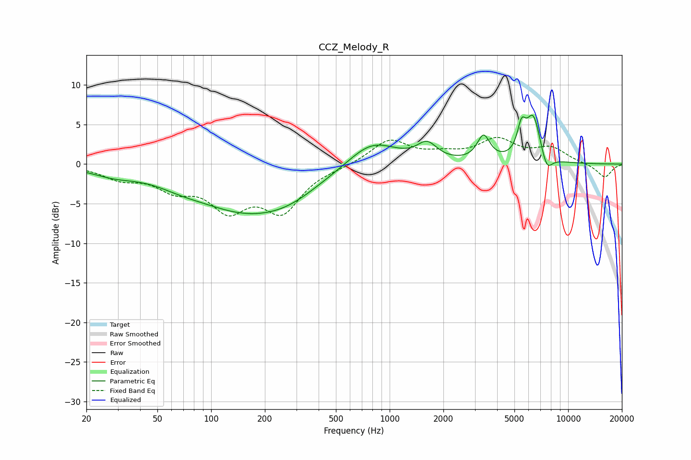

# CCZ_Melody_R
See [usage instructions](https://github.com/jaakkopasanen/AutoEq#usage) for more options and info.

### Parametric EQs
Apply preamp of -6.3 dB when using parametric equalizer.

|   # | Type    |   Fc (Hz) |    Q |   Gain (dB) |
|-----|---------|-----------|------|-------------|
|   1 | Peaking |        28 | 1.12 |        -1   |
|   2 | Peaking |        67 | 1.14 |        -0.6 |
|   3 | Peaking |       161 | 0.46 |        -5.8 |
|   4 | Peaking |       276 | 0.94 |        -1   |
|   5 | Peaking |       794 | 1.03 |         3.3 |
|   6 | Peaking |      1620 | 2.56 |         2.1 |
|   7 | Peaking |      3358 | 3.98 |         3.2 |
|   8 | Peaking |      5479 | 5.94 |         3.2 |
|   9 | Peaking |      6378 | 3.28 |         5.9 |
|  10 | Peaking |      7579 | 4.27 |        -2.2 |

### Fixed Band EQs
When using fixed band (also called graphic) equalizer, apply preamp of **-3.5 dB** (if available) and set gains manually with these parameters.

|   # | Type    |   Fc (Hz) |    Q |   Gain (dB) |
|-----|---------|-----------|------|-------------|
|   1 | Peaking |        31 | 1.41 |        -1.6 |
|   2 | Peaking |        62 | 1.41 |        -2.6 |
|   3 | Peaking |       125 | 1.41 |        -5   |
|   4 | Peaking |       250 | 1.41 |        -5.5 |
|   5 | Peaking |       500 | 1.41 |        -0.3 |
|   6 | Peaking |      1000 | 1.41 |         3   |
|   7 | Peaking |      2000 | 1.41 |         0.9 |
|   8 | Peaking |      4000 | 1.41 |         2.9 |
|   9 | Peaking |      8000 | 1.41 |         1.9 |
|  10 | Peaking |     16000 | 1.41 |        -1.7 |

### Graphs

