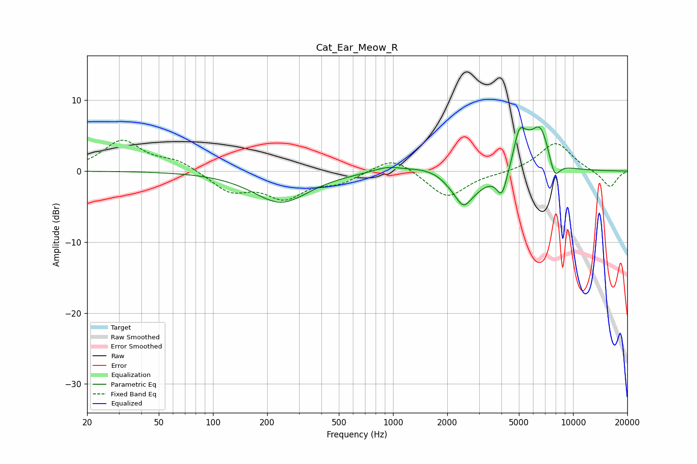

# Cat_Ear_Meow_R
See [usage instructions](https://github.com/jaakkopasanen/AutoEq#usage) for more options and info.

### Parametric EQs
Apply preamp of -6.3 dB when using parametric equalizer.

|   # | Type    |   Fc (Hz) |    Q |   Gain (dB) |
|-----|---------|-----------|------|-------------|
|   1 | Peaking |       238 | 0.92 |        -4.4 |
|   2 | Peaking |       924 | 1.83 |         0.7 |
|   3 | Peaking |      1847 | 0.98 |         1.9 |
|   4 | Peaking |      2443 | 1.39 |        -4.9 |
|   5 | Peaking |      2458 | 4.09 |        -1.4 |
|   6 | Peaking |      4025 | 4.82 |        -3.5 |
|   7 | Peaking |      5014 | 4.41 |         4.4 |
|   8 | Peaking |      5532 | 3.57 |         1.4 |
|   9 | Peaking |      6577 | 2.5  |         6.1 |
|  10 | Peaking |      7876 | 4.29 |        -3   |

### Fixed Band EQs
When using fixed band (also called graphic) equalizer, apply preamp of **-4.4 dB** (if available) and set gains manually with these parameters.

|   # | Type    |   Fc (Hz) |    Q |   Gain (dB) |
|-----|---------|-----------|------|-------------|
|   1 | Peaking |        31 | 1.41 |         4.2 |
|   2 | Peaking |        62 | 1.41 |         1.4 |
|   3 | Peaking |       125 | 1.41 |        -2.8 |
|   4 | Peaking |       250 | 1.41 |        -3.5 |
|   5 | Peaking |       500 | 1.41 |        -1.4 |
|   6 | Peaking |      1000 | 1.41 |         2.2 |
|   7 | Peaking |      2000 | 1.41 |        -3.8 |
|   8 | Peaking |      4000 | 1.41 |        -0.2 |
|   9 | Peaking |      8000 | 1.41 |         4.1 |
|  10 | Peaking |     16000 | 1.41 |        -2.4 |

### Graphs

