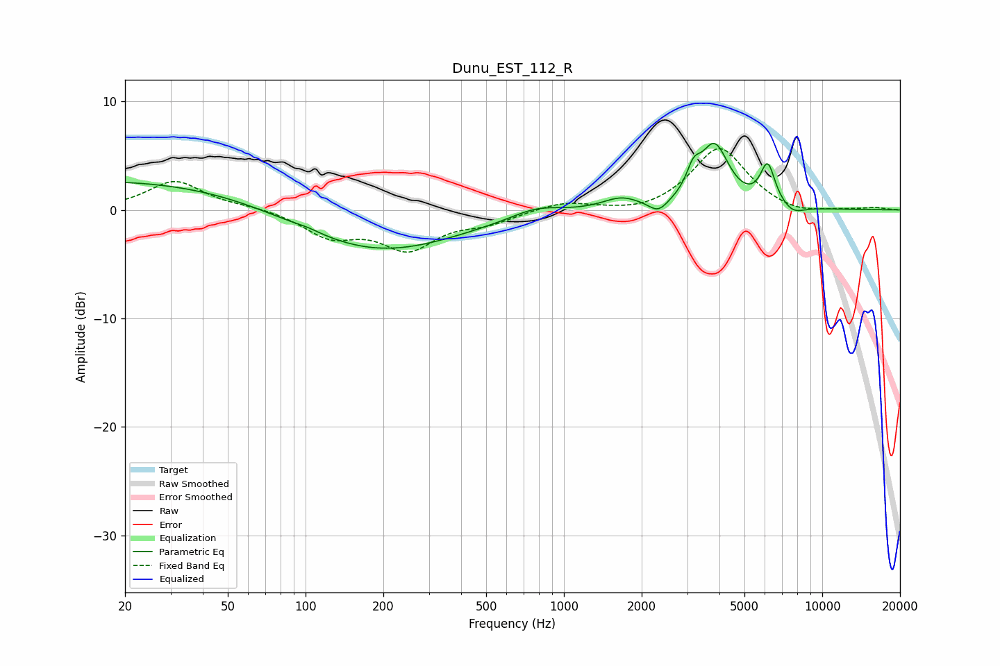

# Dunu_EST_112_R
See [usage instructions](https://github.com/jaakkopasanen/AutoEq#usage) for more options and info.

### Parametric EQs
Apply preamp of -6.2 dB when using parametric equalizer.

|   # | Type    |   Fc (Hz) |    Q |   Gain (dB) |
|-----|---------|-----------|------|-------------|
|   1 | Peaking |        20 | 0.23 |         2.8 |
|   2 | Peaking |       102 | 3.01 |         0.2 |
|   3 | Peaking |       185 | 0.44 |        -4.1 |
|   4 | Peaking |       781 | 1.46 |         0.9 |
|   5 | Peaking |      1666 | 1.96 |         1.1 |
|   6 | Peaking |      2320 | 3.9  |        -1.1 |
|   7 | Peaking |      3174 | 5.21 |         2   |
|   8 | Peaking |      3831 | 2.5  |         5.6 |
|   9 | Peaking |      6149 | 4.78 |         3.7 |
|  10 | Peaking |      7708 | 3.12 |        -0.8 |

### Fixed Band EQs
When using fixed band (also called graphic) equalizer, apply preamp of **-5.7 dB** (if available) and set gains manually with these parameters.

|   # | Type    |   Fc (Hz) |    Q |   Gain (dB) |
|-----|---------|-----------|------|-------------|
|   1 | Peaking |        31 | 1.41 |         2.7 |
|   2 | Peaking |        62 | 1.41 |         0.3 |
|   3 | Peaking |       125 | 1.41 |        -2.3 |
|   4 | Peaking |       250 | 1.41 |        -3.4 |
|   5 | Peaking |       500 | 1.41 |        -1   |
|   6 | Peaking |      1000 | 1.41 |         0.8 |
|   7 | Peaking |      2000 | 1.41 |        -0.4 |
|   8 | Peaking |      4000 | 1.41 |         5.8 |
|   9 | Peaking |      8000 | 1.41 |        -0.6 |
|  10 | Peaking |     16000 | 1.41 |         0.2 |

### Graphs

