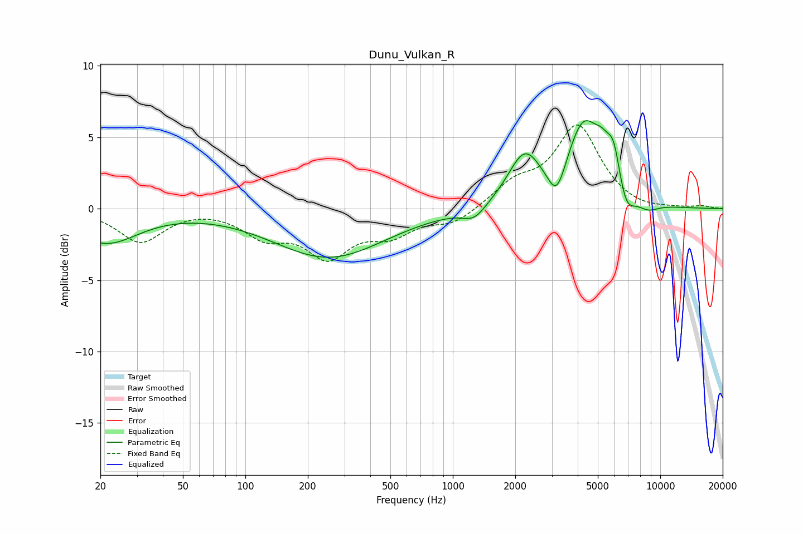

# Dunu_Vulkan_R
See [usage instructions](https://github.com/jaakkopasanen/AutoEq#usage) for more options and info.

### Parametric EQs
Apply preamp of -6.3 dB when using parametric equalizer.

|   # | Type    |   Fc (Hz) |    Q |   Gain (dB) |
|-----|---------|-----------|------|-------------|
|   1 | Peaking |        21 | 0.9  |        -2.3 |
|   2 | Peaking |       253 | 0.53 |        -3.4 |
|   3 | Peaking |      1269 | 2.49 |        -0.9 |
|   4 | Peaking |      2217 | 1.77 |         3.5 |
|   5 | Peaking |      3168 | 3.34 |        -2.2 |
|   6 | Peaking |      4262 | 1.7  |         5.6 |
|   7 | Peaking |      5252 | 3.46 |         1.4 |
|   8 | Peaking |      5972 | 4.2  |         2.6 |
|   9 | Peaking |      6826 | 3.35 |        -1.7 |
|  10 | Peaking |      8737 | 2.5  |        -0.6 |

### Fixed Band EQs
When using fixed band (also called graphic) equalizer, apply preamp of **-6.0 dB** (if available) and set gains manually with these parameters.

|   # | Type    |   Fc (Hz) |    Q |   Gain (dB) |
|-----|---------|-----------|------|-------------|
|   1 | Peaking |        31 | 1.41 |        -2.3 |
|   2 | Peaking |        62 | 1.41 |         0.1 |
|   3 | Peaking |       125 | 1.41 |        -1.7 |
|   4 | Peaking |       250 | 1.41 |        -3.1 |
|   5 | Peaking |       500 | 1.41 |        -1.6 |
|   6 | Peaking |      1000 | 1.41 |        -1   |
|   7 | Peaking |      2000 | 1.41 |         1.6 |
|   8 | Peaking |      4000 | 1.41 |         5.7 |
|   9 | Peaking |      8000 | 1.41 |        -0.2 |
|  10 | Peaking |     16000 | 1.41 |         0.2 |

### Graphs

