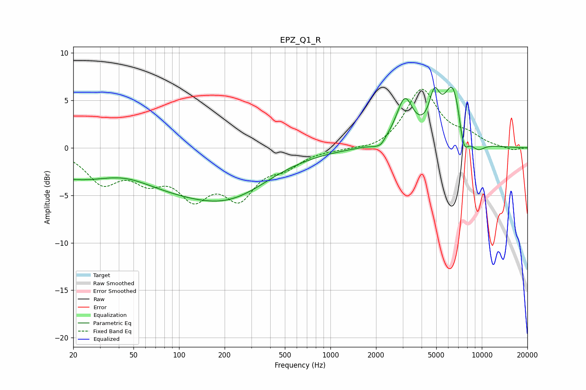

# EPZ_Q1_R
See [usage instructions](https://github.com/jaakkopasanen/AutoEq#usage) for more options and info.

### Parametric EQs
Apply preamp of -6.5 dB when using parametric equalizer.

|   # | Type    |   Fc (Hz) |    Q |   Gain (dB) |
|-----|---------|-----------|------|-------------|
|   1 | Peaking |        43 | 0.74 |         1.7 |
|   2 | Peaking |        54 | 0.18 |        -4.7 |
|   3 | Peaking |       230 | 0.57 |        -2.4 |
|   4 | Peaking |      1968 | 3.9  |        -0.3 |
|   5 | Peaking |      2166 | 5.98 |        -0.5 |
|   6 | Peaking |      3095 | 2.52 |         4.7 |
|   7 | Peaking |      4861 | 3.98 |         3.7 |
|   8 | Peaking |      6492 | 2.17 |         6.8 |
|   9 | Peaking |      7573 | 3.93 |        -3.6 |
|  10 | Peaking |      9369 | 2.69 |        -1.1 |

### Fixed Band EQs
When using fixed band (also called graphic) equalizer, apply preamp of **-6.3 dB** (if available) and set gains manually with these parameters.

|   # | Type    |   Fc (Hz) |    Q |   Gain (dB) |
|-----|---------|-----------|------|-------------|
|   1 | Peaking |        31 | 1.41 |        -3.4 |
|   2 | Peaking |        62 | 1.41 |        -2.7 |
|   3 | Peaking |       125 | 1.41 |        -4.4 |
|   4 | Peaking |       250 | 1.41 |        -4.6 |
|   5 | Peaking |       500 | 1.41 |        -1.6 |
|   6 | Peaking |      1000 | 1.41 |        -0.1 |
|   7 | Peaking |      2000 | 1.41 |        -0.4 |
|   8 | Peaking |      4000 | 1.41 |         6.1 |
|   9 | Peaking |      8000 | 1.41 |         1.1 |
|  10 | Peaking |     16000 | 1.41 |        -0.3 |

### Graphs

