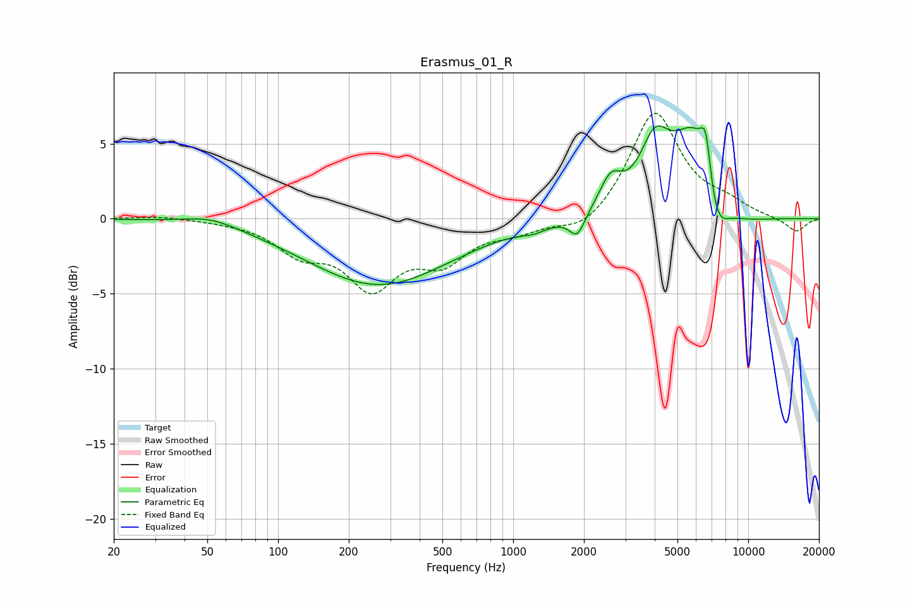

# Erasmus_01_R
See [usage instructions](https://github.com/jaakkopasanen/AutoEq#usage) for more options and info.

### Parametric EQs
Apply preamp of -6.3 dB when using parametric equalizer.

|   # | Type    |   Fc (Hz) |    Q |   Gain (dB) |
|-----|---------|-----------|------|-------------|
|   1 | Peaking |        52 | 1.26 |         0.6 |
|   2 | Peaking |       268 | 0.47 |        -4.4 |
|   3 | Peaking |      1222 | 2.68 |        -0.4 |
|   4 | Peaking |      1874 | 4.29 |        -1.5 |
|   5 | Peaking |      2598 | 2.97 |         2   |
|   6 | Peaking |      3995 | 2.27 |         3.7 |
|   7 | Peaking |      6019 | 1.32 |         7   |
|   8 | Peaking |      6607 | 5.93 |         3.1 |
|   9 | Peaking |      7213 | 2.4  |        -4.4 |
|  10 | Peaking |      8686 | 0.95 |        -1.2 |

### Fixed Band EQs
When using fixed band (also called graphic) equalizer, apply preamp of **-7.1 dB** (if available) and set gains manually with these parameters.

|   # | Type    |   Fc (Hz) |    Q |   Gain (dB) |
|-----|---------|-----------|------|-------------|
|   1 | Peaking |        31 | 1.41 |         0.2 |
|   2 | Peaking |        62 | 1.41 |        -0.1 |
|   3 | Peaking |       125 | 1.41 |        -2   |
|   4 | Peaking |       250 | 1.41 |        -4.2 |
|   5 | Peaking |       500 | 1.41 |        -2.5 |
|   6 | Peaking |      1000 | 1.41 |        -0.7 |
|   7 | Peaking |      2000 | 1.41 |        -1.1 |
|   8 | Peaking |      4000 | 1.41 |         7.2 |
|   9 | Peaking |      8000 | 1.41 |         0.8 |
|  10 | Peaking |     16000 | 1.41 |        -0.9 |

### Graphs

