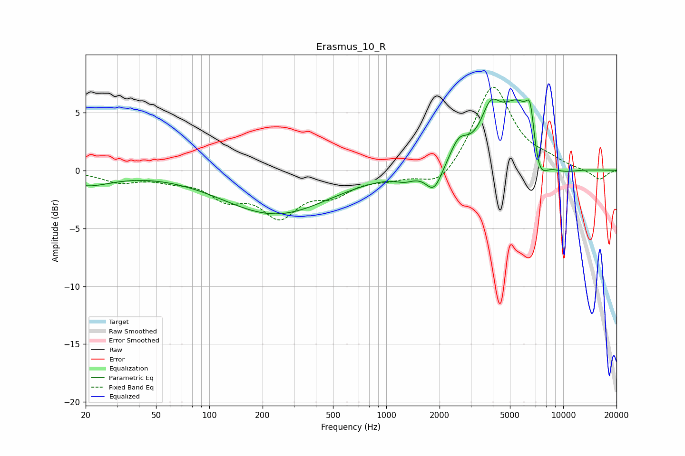

# Erasmus_10_R
See [usage instructions](https://github.com/jaakkopasanen/AutoEq#usage) for more options and info.

### Parametric EQs
Apply preamp of -6.3 dB when using parametric equalizer.

|   # | Type    |   Fc (Hz) |    Q |   Gain (dB) |
|-----|---------|-----------|------|-------------|
|   1 | Peaking |        20 | 0.94 |        -1.2 |
|   2 | Peaking |       237 | 0.47 |        -3.7 |
|   3 | Peaking |      1275 | 2.57 |        -0.5 |
|   4 | Peaking |      1861 | 3.06 |        -2.1 |
|   5 | Peaking |      2569 | 2.81 |         1.9 |
|   6 | Peaking |      3880 | 2.64 |         3.1 |
|   7 | Peaking |      5737 | 1.18 |         6.5 |
|   8 | Peaking |      6526 | 5.79 |         3.3 |
|   9 | Peaking |      7223 | 2.55 |        -4.2 |
|  10 | Peaking |      9428 | 1.15 |        -1.1 |

### Fixed Band EQs
When using fixed band (also called graphic) equalizer, apply preamp of **-7.3 dB** (if available) and set gains manually with these parameters.

|   # | Type    |   Fc (Hz) |    Q |   Gain (dB) |
|-----|---------|-----------|------|-------------|
|   1 | Peaking |        31 | 1.41 |        -0.9 |
|   2 | Peaking |        62 | 1.41 |        -0.6 |
|   3 | Peaking |       125 | 1.41 |        -2   |
|   4 | Peaking |       250 | 1.41 |        -3.6 |
|   5 | Peaking |       500 | 1.41 |        -1.7 |
|   6 | Peaking |      1000 | 1.41 |        -0.6 |
|   7 | Peaking |      2000 | 1.41 |        -1.7 |
|   8 | Peaking |      4000 | 1.41 |         7.4 |
|   9 | Peaking |      8000 | 1.41 |         0.6 |
|  10 | Peaking |     16000 | 1.41 |        -0.8 |

### Graphs

