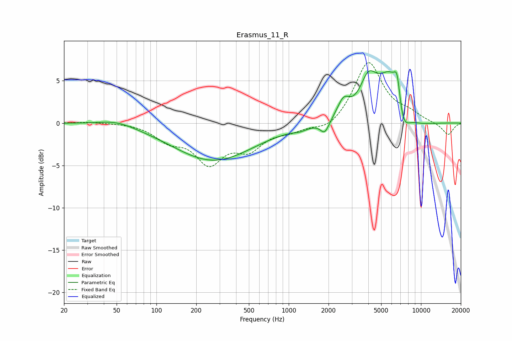

# Erasmus_11_R
See [usage instructions](https://github.com/jaakkopasanen/AutoEq#usage) for more options and info.

### Parametric EQs
Apply preamp of -6.3 dB when using parametric equalizer.

|   # | Type    |   Fc (Hz) |    Q |   Gain (dB) |
|-----|---------|-----------|------|-------------|
|   1 | Peaking |        50 | 1.05 |         0.7 |
|   2 | Peaking |       270 | 0.47 |        -4.4 |
|   3 | Peaking |      1219 | 2.58 |        -0.3 |
|   4 | Peaking |      1874 | 4.23 |        -1.5 |
|   5 | Peaking |      2593 | 3.06 |         2   |
|   6 | Peaking |      3997 | 2.3  |         3.7 |
|   7 | Peaking |      6033 | 1.31 |         7   |
|   8 | Peaking |      6611 | 5.95 |         3.1 |
|   9 | Peaking |      7227 | 2.47 |        -4.5 |
|  10 | Peaking |      8847 | 0.97 |        -1.2 |

### Fixed Band EQs
When using fixed band (also called graphic) equalizer, apply preamp of **-7.2 dB** (if available) and set gains manually with these parameters.

|   # | Type    |   Fc (Hz) |    Q |   Gain (dB) |
|-----|---------|-----------|------|-------------|
|   1 | Peaking |        31 | 1.41 |         0.2 |
|   2 | Peaking |        62 | 1.41 |         0.1 |
|   3 | Peaking |       125 | 1.41 |        -1.8 |
|   4 | Peaking |       250 | 1.41 |        -4.3 |
|   5 | Peaking |       500 | 1.41 |        -2.7 |
|   6 | Peaking |      1000 | 1.41 |        -0.8 |
|   7 | Peaking |      2000 | 1.41 |        -1   |
|   8 | Peaking |      4000 | 1.41 |         7.3 |
|   9 | Peaking |      8000 | 1.41 |         0.9 |
|  10 | Peaking |     16000 | 1.41 |        -1.4 |

### Graphs

