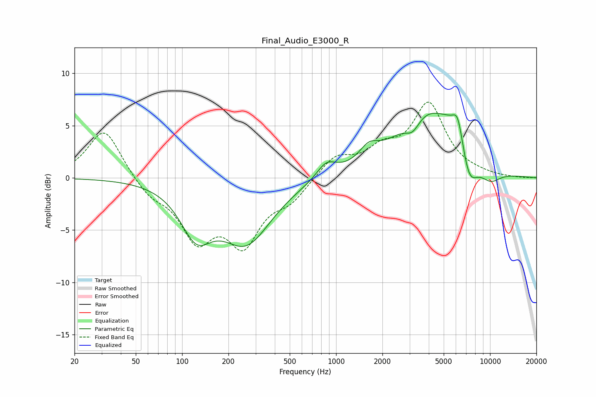

# Final_Audio_E3000_R
See [usage instructions](https://github.com/jaakkopasanen/AutoEq#usage) for more options and info.

### Parametric EQs
Apply preamp of -6.3 dB when using parametric equalizer.

|   # | Type    |   Fc (Hz) |    Q |   Gain (dB) |
|-----|---------|-----------|------|-------------|
|   1 | Peaking |       123 | 1.4  |        -4.4 |
|   2 | Peaking |       260 | 0.86 |        -5.9 |
|   3 | Peaking |       865 | 2.21 |         1.5 |
|   4 | Peaking |      1632 | 2.27 |         1.4 |
|   5 | Peaking |      3143 | 2.89 |        -1.4 |
|   6 | Peaking |      3899 | 0.7  |         6.3 |
|   7 | Peaking |      5404 | 2.28 |         0.8 |
|   8 | Peaking |      6177 | 3.95 |         2.7 |
|   9 | Peaking |      7320 | 2.5  |        -3   |
|  10 | Peaking |     10000 | 1.71 |        -1.4 |

### Fixed Band EQs
When using fixed band (also called graphic) equalizer, apply preamp of **-7.3 dB** (if available) and set gains manually with these parameters.

|   # | Type    |   Fc (Hz) |    Q |   Gain (dB) |
|-----|---------|-----------|------|-------------|
|   1 | Peaking |        31 | 1.41 |         4.8 |
|   2 | Peaking |        62 | 1.41 |        -1.5 |
|   3 | Peaking |       125 | 1.41 |        -5.4 |
|   4 | Peaking |       250 | 1.41 |        -5.7 |
|   5 | Peaking |       500 | 1.41 |        -1.8 |
|   6 | Peaking |      1000 | 1.41 |         2   |
|   7 | Peaking |      2000 | 1.41 |         2.2 |
|   8 | Peaking |      4000 | 1.41 |         6.8 |
|   9 | Peaking |      8000 | 1.41 |         0.2 |
|  10 | Peaking |     16000 | 1.41 |        -0   |

### Graphs

