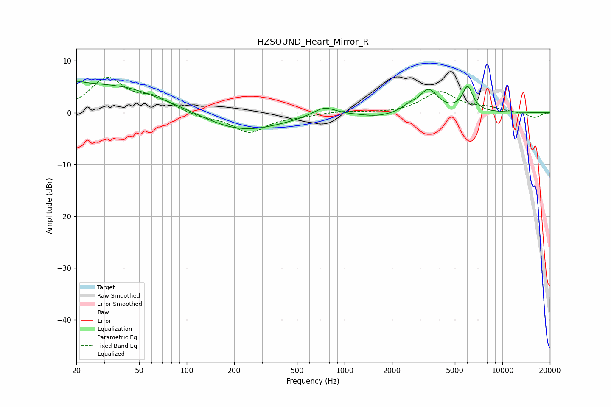

# HZSOUND_Heart_Mirror_R
See [usage instructions](https://github.com/jaakkopasanen/AutoEq#usage) for more options and info.

### Parametric EQs
Apply preamp of -6.1 dB when using parametric equalizer.

|   # | Type    |   Fc (Hz) |    Q |   Gain (dB) |
|-----|---------|-----------|------|-------------|
|   1 | Peaking |        20 | 5.52 |         3.5 |
|   2 | Peaking |        20 | 5.85 |        -3   |
|   3 | Peaking |        23 | 0.28 |         5.7 |
|   4 | Peaking |        43 | 2.23 |         0.2 |
|   5 | Peaking |       220 | 0.56 |        -3.9 |
|   6 | Peaking |       743 | 2    |         1.8 |
|   7 | Peaking |      1642 | 1.36 |        -0.8 |
|   8 | Peaking |      2594 | 2.93 |         0.9 |
|   9 | Peaking |      3411 | 2.46 |         4.2 |
|  10 | Peaking |      6022 | 4.16 |         4.7 |

### Fixed Band EQs
When using fixed band (also called graphic) equalizer, apply preamp of **-6.9 dB** (if available) and set gains manually with these parameters.

|   # | Type    |   Fc (Hz) |    Q |   Gain (dB) |
|-----|---------|-----------|------|-------------|
|   1 | Peaking |        31 | 1.41 |         6.4 |
|   2 | Peaking |        62 | 1.41 |         2.4 |
|   3 | Peaking |       125 | 1.41 |        -0.8 |
|   4 | Peaking |       250 | 1.41 |        -3.7 |
|   5 | Peaking |       500 | 1.41 |        -0.5 |
|   6 | Peaking |      1000 | 1.41 |         0.3 |
|   7 | Peaking |      2000 | 1.41 |        -0.2 |
|   8 | Peaking |      4000 | 1.41 |         4   |
|   9 | Peaking |      8000 | 1.41 |         0.8 |
|  10 | Peaking |     16000 | 1.41 |        -1   |

### Graphs

