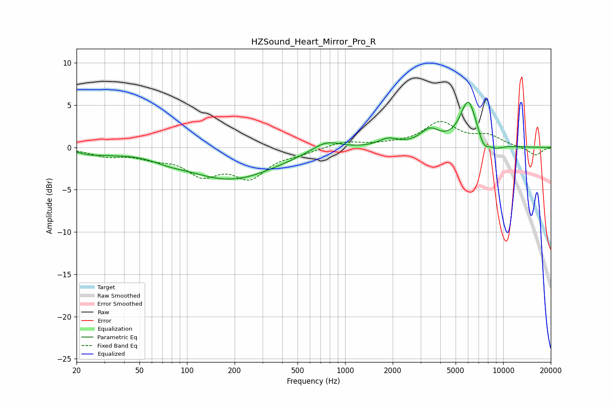

# HZSound_Heart_Mirror_Pro_R
See [usage instructions](https://github.com/jaakkopasanen/AutoEq#usage) for more options and info.

### Parametric EQs
Apply preamp of -5.4 dB when using parametric equalizer.

|   # | Type    |   Fc (Hz) |    Q |   Gain (dB) |
|-----|---------|-----------|------|-------------|
|   1 | Peaking |        24 | 2.28 |        -0.4 |
|   2 | Peaking |        33 | 1.47 |        -0.4 |
|   3 | Peaking |        76 | 1.45 |        -0.4 |
|   4 | Peaking |       188 | 0.5  |        -3.7 |
|   5 | Peaking |       758 | 1.55 |         1.3 |
|   6 | Peaking |      1876 | 2.32 |         0.9 |
|   7 | Peaking |      3433 | 2.29 |         1.8 |
|   8 | Peaking |      6023 | 2.61 |         5.5 |
|   9 | Peaking |      7520 | 3.94 |        -1.4 |
|  10 | Peaking |      8992 | 2.86 |        -0.5 |

### Fixed Band EQs
When using fixed band (also called graphic) equalizer, apply preamp of **-3.2 dB** (if available) and set gains manually with these parameters.

|   # | Type    |   Fc (Hz) |    Q |   Gain (dB) |
|-----|---------|-----------|------|-------------|
|   1 | Peaking |        31 | 1.41 |        -0.9 |
|   2 | Peaking |        62 | 1.41 |        -1   |
|   3 | Peaking |       125 | 1.41 |        -2.9 |
|   4 | Peaking |       250 | 1.41 |        -3.2 |
|   5 | Peaking |       500 | 1.41 |        -0.5 |
|   6 | Peaking |      1000 | 1.41 |         0.7 |
|   7 | Peaking |      2000 | 1.41 |         0.3 |
|   8 | Peaking |      4000 | 1.41 |         2.8 |
|   9 | Peaking |      8000 | 1.41 |         1.2 |
|  10 | Peaking |     16000 | 1.41 |        -1   |

### Graphs

