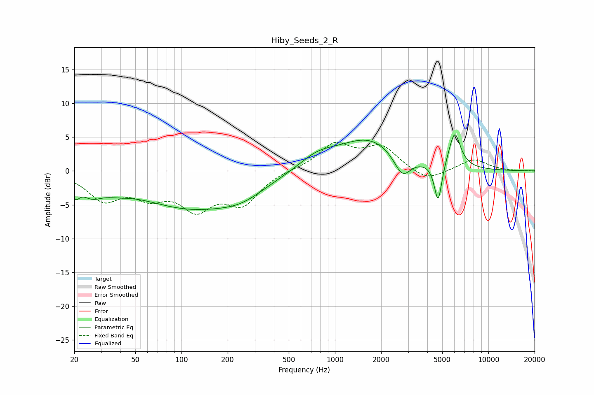

# Hiby_Seeds_2_R
See [usage instructions](https://github.com/jaakkopasanen/AutoEq#usage) for more options and info.

### Parametric EQs
Apply preamp of -5.4 dB when using parametric equalizer.

|   # | Type    |   Fc (Hz) |    Q |   Gain (dB) |
|-----|---------|-----------|------|-------------|
|   1 | Peaking |        20 | 5.43 |        -2   |
|   2 | Peaking |        26 | 2.07 |        -2.1 |
|   3 | Peaking |        37 | 1.39 |        -1   |
|   4 | Peaking |       113 | 0.41 |        -5.2 |
|   5 | Peaking |       247 | 0.94 |        -1.6 |
|   6 | Peaking |       768 | 1.19 |         1.8 |
|   7 | Peaking |      1672 | 0.69 |         4.7 |
|   8 | Peaking |      2749 | 2.53 |        -3.4 |
|   9 | Peaking |      4703 | 5.73 |        -6   |
|  10 | Peaking |      6026 | 3.62 |         5.4 |

### Fixed Band EQs
When using fixed band (also called graphic) equalizer, apply preamp of **-4.3 dB** (if available) and set gains manually with these parameters.

|   # | Type    |   Fc (Hz) |    Q |   Gain (dB) |
|-----|---------|-----------|------|-------------|
|   1 | Peaking |        31 | 1.41 |        -4   |
|   2 | Peaking |        62 | 1.41 |        -3   |
|   3 | Peaking |       125 | 1.41 |        -4.9 |
|   4 | Peaking |       250 | 1.41 |        -4.5 |
|   5 | Peaking |       500 | 1.41 |         0.2 |
|   6 | Peaking |      1000 | 1.41 |         3.8 |
|   7 | Peaking |      2000 | 1.41 |         3.4 |
|   8 | Peaking |      4000 | 1.41 |        -1.7 |
|   9 | Peaking |      8000 | 1.41 |         1.7 |
|  10 | Peaking |     16000 | 1.41 |        -0   |

### Graphs

