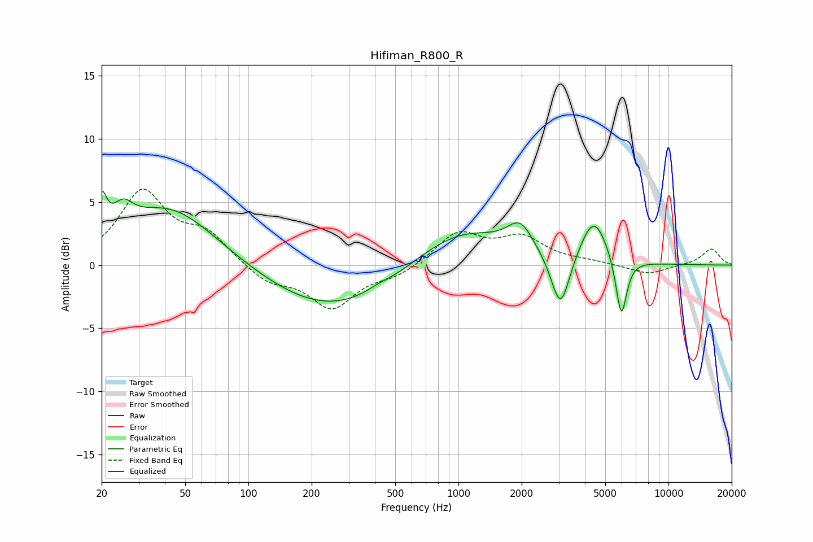

# Hifiman_R800_R
See [usage instructions](https://github.com/jaakkopasanen/AutoEq#usage) for more options and info.

### Parametric EQs
Apply preamp of -5.9 dB when using parametric equalizer.

|   # | Type    |   Fc (Hz) |    Q |   Gain (dB) |
|-----|---------|-----------|------|-------------|
|   1 | Peaking |        20 | 6    |         3   |
|   2 | Peaking |        25 | 2.92 |         1.8 |
|   3 | Peaking |        42 | 0.62 |         4.7 |
|   4 | Peaking |       255 | 0.45 |        -3.7 |
|   5 | Peaking |       411 | 2.75 |         0.2 |
|   6 | Peaking |      1005 | 0.62 |         3.1 |
|   7 | Peaking |      1971 | 2.35 |         2.2 |
|   8 | Peaking |      3059 | 3.19 |        -4.6 |
|   9 | Peaking |      4409 | 2.19 |         3.7 |
|  10 | Peaking |      5962 | 5.29 |        -4.8 |

### Fixed Band EQs
When using fixed band (also called graphic) equalizer, apply preamp of **-6.1 dB** (if available) and set gains manually with these parameters.

|   # | Type    |   Fc (Hz) |    Q |   Gain (dB) |
|-----|---------|-----------|------|-------------|
|   1 | Peaking |        31 | 1.41 |         5.7 |
|   2 | Peaking |        62 | 1.41 |         2.2 |
|   3 | Peaking |       125 | 1.41 |        -1.4 |
|   4 | Peaking |       250 | 1.41 |        -3.3 |
|   5 | Peaking |       500 | 1.41 |        -0.8 |
|   6 | Peaking |      1000 | 1.41 |         2.5 |
|   7 | Peaking |      2000 | 1.41 |         2   |
|   8 | Peaking |      4000 | 1.41 |         0.2 |
|   9 | Peaking |      8000 | 1.41 |        -0.8 |
|  10 | Peaking |     16000 | 1.41 |         1.3 |

### Graphs

