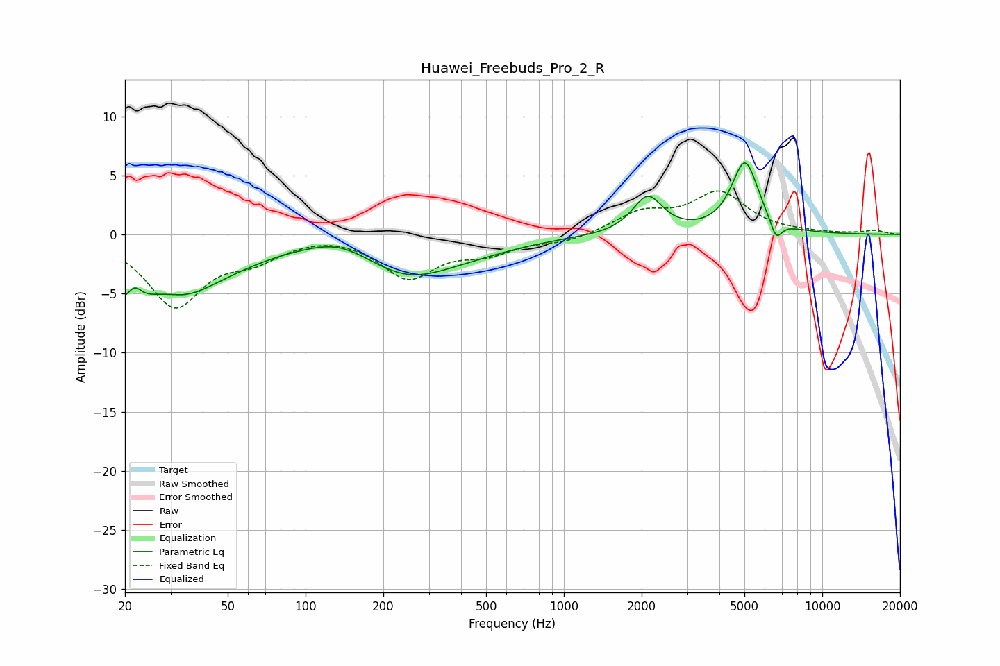

# Huawei_Freebuds_Pro_2_R
See [usage instructions](https://github.com/jaakkopasanen/AutoEq#usage) for more options and info.

### Parametric EQs
Apply preamp of -6.2 dB when using parametric equalizer.

|   # | Type    |   Fc (Hz) |    Q |   Gain (dB) |
|-----|---------|-----------|------|-------------|
|   1 | Peaking |        21 | 1.93 |        -4.7 |
|   2 | Peaking |        22 | 4.46 |         2.2 |
|   3 | Peaking |        34 | 1.57 |        -1.1 |
|   4 | Peaking |        38 | 0.67 |        -3.2 |
|   5 | Peaking |       135 | 1.19 |         1.1 |
|   6 | Peaking |       248 | 0.83 |        -3   |
|   7 | Peaking |       445 | 0.71 |        -0.8 |
|   8 | Peaking |      2110 | 2.47 |         3.2 |
|   9 | Peaking |      5025 | 2.68 |         6.1 |
|  10 | Peaking |      6626 | 5.89 |        -1.7 |

### Fixed Band EQs
When using fixed band (also called graphic) equalizer, apply preamp of **-3.8 dB** (if available) and set gains manually with these parameters.

|   # | Type    |   Fc (Hz) |    Q |   Gain (dB) |
|-----|---------|-----------|------|-------------|
|   1 | Peaking |        31 | 1.41 |        -5.9 |
|   2 | Peaking |        62 | 1.41 |        -1.7 |
|   3 | Peaking |       125 | 1.41 |         0.3 |
|   4 | Peaking |       250 | 1.41 |        -3.5 |
|   5 | Peaking |       500 | 1.41 |        -1.3 |
|   6 | Peaking |      1000 | 1.41 |        -0.6 |
|   7 | Peaking |      2000 | 1.41 |         1.7 |
|   8 | Peaking |      4000 | 1.41 |         3.4 |
|   9 | Peaking |      8000 | 1.41 |         0.1 |
|  10 | Peaking |     16000 | 1.41 |         0.3 |

### Graphs

