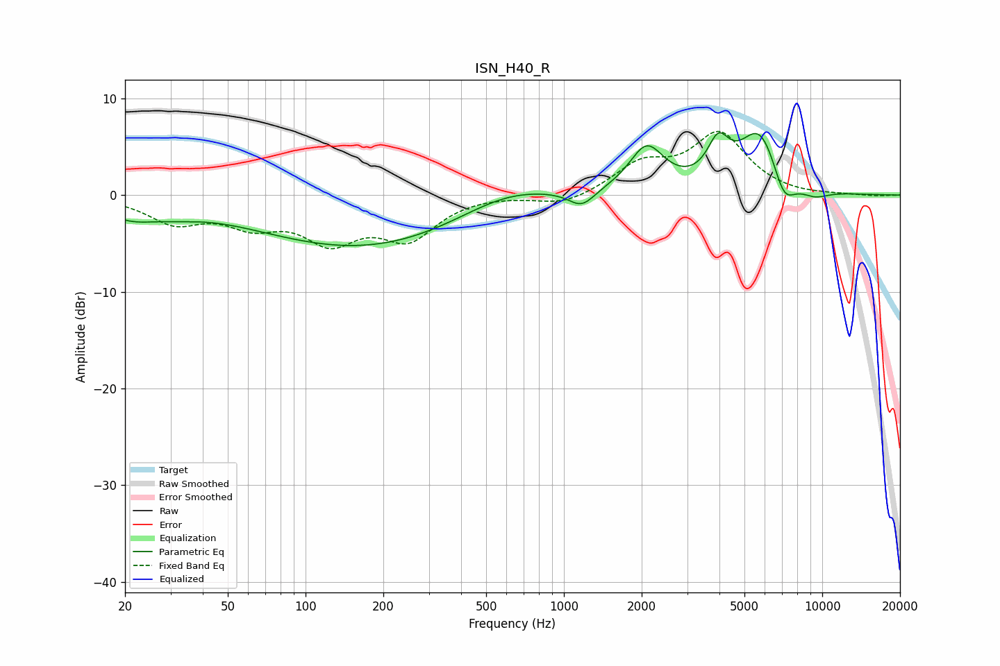

# ISN_H40_R
See [usage instructions](https://github.com/jaakkopasanen/AutoEq#usage) for more options and info.

### Parametric EQs
Apply preamp of -6.6 dB when using parametric equalizer.

|   # | Type    |   Fc (Hz) |    Q |   Gain (dB) |
|-----|---------|-----------|------|-------------|
|   1 | Peaking |        21 | 1.3  |        -1.8 |
|   2 | Peaking |        32 | 1.47 |        -0.5 |
|   3 | Peaking |       169 | 0.33 |        -5.5 |
|   4 | Peaking |       598 | 0.73 |         2.2 |
|   5 | Peaking |      1172 | 2.81 |        -1.7 |
|   6 | Peaking |      2091 | 2.09 |         4.7 |
|   7 | Peaking |      3957 | 3.36 |         3.9 |
|   8 | Peaking |      5738 | 1.7  |         6.7 |
|   9 | Peaking |      7107 | 3.06 |        -3.4 |
|  10 | Peaking |      9315 | 2.2  |        -0.9 |

### Fixed Band EQs
When using fixed band (also called graphic) equalizer, apply preamp of **-6.7 dB** (if available) and set gains manually with these parameters.

|   # | Type    |   Fc (Hz) |    Q |   Gain (dB) |
|-----|---------|-----------|------|-------------|
|   1 | Peaking |        31 | 1.41 |        -2.6 |
|   2 | Peaking |        62 | 1.41 |        -2.5 |
|   3 | Peaking |       125 | 1.41 |        -4.2 |
|   4 | Peaking |       250 | 1.41 |        -4.1 |
|   5 | Peaking |       500 | 1.41 |         0.1 |
|   6 | Peaking |      1000 | 1.41 |        -1.1 |
|   7 | Peaking |      2000 | 1.41 |         2.9 |
|   8 | Peaking |      4000 | 1.41 |         6.1 |
|   9 | Peaking |      8000 | 1.41 |        -0.1 |
|  10 | Peaking |     16000 | 1.41 |        -0.1 |

### Graphs

