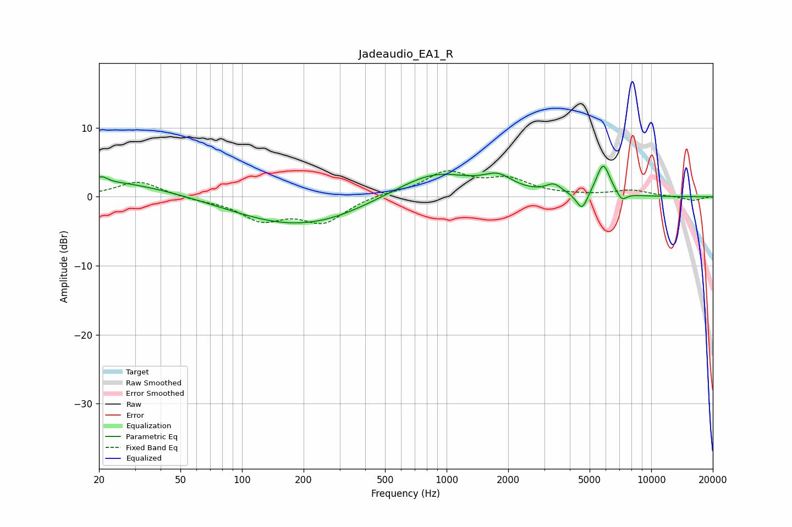

# Jadeaudio_EA1_R
See [usage instructions](https://github.com/jaakkopasanen/AutoEq#usage) for more options and info.

### Parametric EQs
Apply preamp of -4.5 dB when using parametric equalizer.

|   # | Type    |   Fc (Hz) |    Q |   Gain (dB) |
|-----|---------|-----------|------|-------------|
|   1 | Peaking |        21 | 5.69 |         0.8 |
|   2 | Peaking |        21 | 0.44 |         2.4 |
|   3 | Peaking |       167 | 0.5  |        -3.7 |
|   4 | Peaking |       281 | 0.76 |        -0.8 |
|   5 | Peaking |       878 | 0.77 |         3.6 |
|   6 | Peaking |      1783 | 2.01 |         2   |
|   7 | Peaking |      3340 | 3.7  |         1.3 |
|   8 | Peaking |      4589 | 5.04 |        -2.7 |
|   9 | Peaking |      5823 | 4.09 |         4.7 |
|  10 | Peaking |      7183 | 5.69 |        -1.2 |

### Fixed Band EQs
When using fixed band (also called graphic) equalizer, apply preamp of **-3.9 dB** (if available) and set gains manually with these parameters.

|   # | Type    |   Fc (Hz) |    Q |   Gain (dB) |
|-----|---------|-----------|------|-------------|
|   1 | Peaking |        31 | 1.41 |         2.3 |
|   2 | Peaking |        62 | 1.41 |        -0.4 |
|   3 | Peaking |       125 | 1.41 |        -3.1 |
|   4 | Peaking |       250 | 1.41 |        -3.5 |
|   5 | Peaking |       500 | 1.41 |         0.5 |
|   6 | Peaking |      1000 | 1.41 |         3.4 |
|   7 | Peaking |      2000 | 1.41 |         2.3 |
|   8 | Peaking |      4000 | 1.41 |         0.1 |
|   9 | Peaking |      8000 | 1.41 |         0.9 |
|  10 | Peaking |     16000 | 1.41 |        -0.6 |

### Graphs

