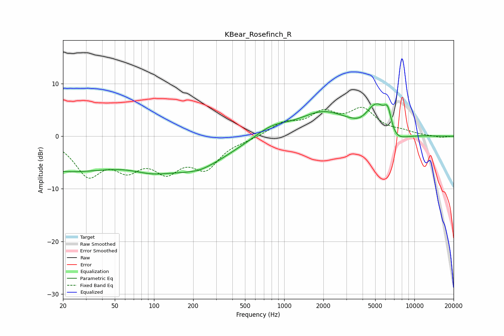

# KBear_Rosefinch_R
See [usage instructions](https://github.com/jaakkopasanen/AutoEq#usage) for more options and info.

### Parametric EQs
Apply preamp of -6.3 dB when using parametric equalizer.

|   # | Type    |   Fc (Hz) |    Q |   Gain (dB) |
|-----|---------|-----------|------|-------------|
|   1 | Peaking |        20 | 0.3  |        -6.4 |
|   2 | Peaking |        96 | 0.9  |        -2.1 |
|   3 | Peaking |       213 | 0.55 |        -5.4 |
|   4 | Peaking |       228 | 2.66 |        -0.1 |
|   5 | Peaking |       799 | 1.06 |         1.9 |
|   6 | Peaking |      1991 | 0.77 |         4.3 |
|   7 | Peaking |      3865 | 1.94 |        -1.2 |
|   8 | Peaking |      5202 | 1.49 |         7.2 |
|   9 | Peaking |      6256 | 4.49 |         4.2 |
|  10 | Peaking |      6675 | 1.48 |        -4.4 |

### Fixed Band EQs
When using fixed band (also called graphic) equalizer, apply preamp of **-5.6 dB** (if available) and set gains manually with these parameters.

|   # | Type    |   Fc (Hz) |    Q |   Gain (dB) |
|-----|---------|-----------|------|-------------|
|   1 | Peaking |        31 | 1.41 |        -6.8 |
|   2 | Peaking |        62 | 1.41 |        -4.9 |
|   3 | Peaking |       125 | 1.41 |        -5.5 |
|   4 | Peaking |       250 | 1.41 |        -5.4 |
|   5 | Peaking |       500 | 1.41 |        -0.5 |
|   6 | Peaking |      1000 | 1.41 |         2.3 |
|   7 | Peaking |      2000 | 1.41 |         3.9 |
|   8 | Peaking |      4000 | 1.41 |         4.7 |
|   9 | Peaking |      8000 | 1.41 |         0.7 |
|  10 | Peaking |     16000 | 1.41 |        -0.3 |

### Graphs

