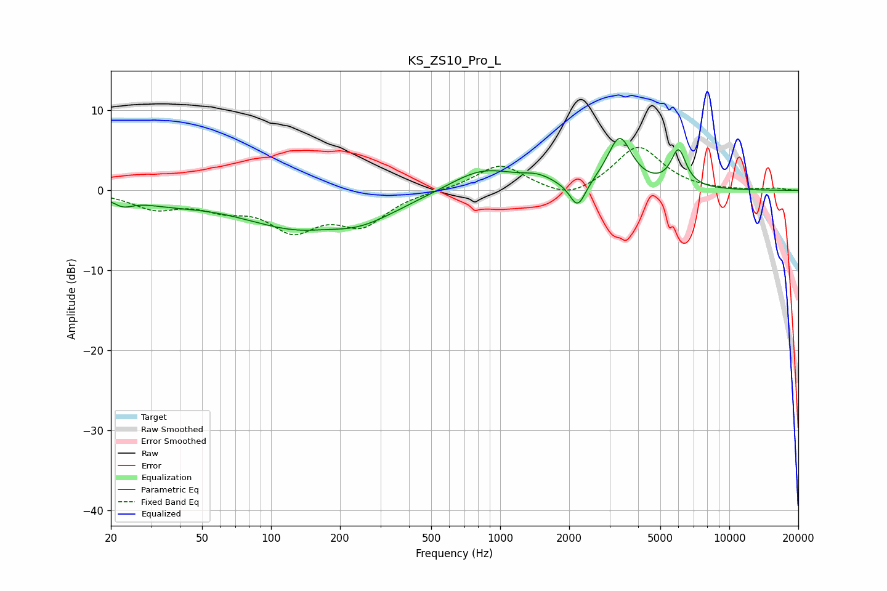

# KS_ZS10_Pro_L
See [usage instructions](https://github.com/jaakkopasanen/AutoEq#usage) for more options and info.

### Parametric EQs
Apply preamp of -6.6 dB when using parametric equalizer.

|   # | Type    |   Fc (Hz) |    Q |   Gain (dB) |
|-----|---------|-----------|------|-------------|
|   1 | Peaking |        23 | 3.25 |        -1   |
|   2 | Peaking |        35 | 0.95 |        -1   |
|   3 | Peaking |       145 | 0.5  |        -4.8 |
|   4 | Peaking |       176 | 1.37 |         0.7 |
|   5 | Peaking |       242 | 0.91 |        -1.4 |
|   6 | Peaking |       837 | 0.96 |         2.9 |
|   7 | Peaking |      1460 | 2.05 |         1   |
|   8 | Peaking |      2179 | 4.06 |        -3.3 |
|   9 | Peaking |      3320 | 2.61 |         6.4 |
|  10 | Peaking |      6003 | 4.17 |         4.6 |

### Fixed Band EQs
When using fixed band (also called graphic) equalizer, apply preamp of **-5.5 dB** (if available) and set gains manually with these parameters.

|   # | Type    |   Fc (Hz) |    Q |   Gain (dB) |
|-----|---------|-----------|------|-------------|
|   1 | Peaking |        31 | 1.41 |        -2   |
|   2 | Peaking |        62 | 1.41 |        -1.8 |
|   3 | Peaking |       125 | 1.41 |        -4.5 |
|   4 | Peaking |       250 | 1.41 |        -3.9 |
|   5 | Peaking |       500 | 1.41 |        -0   |
|   6 | Peaking |      1000 | 1.41 |         3.3 |
|   7 | Peaking |      2000 | 1.41 |        -1.5 |
|   8 | Peaking |      4000 | 1.41 |         5.5 |
|   9 | Peaking |      8000 | 1.41 |        -0.1 |
|  10 | Peaking |     16000 | 1.41 |         0.2 |

### Graphs

