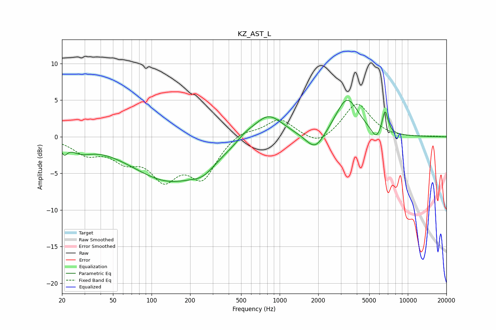

# KZ_AST_L
See [usage instructions](https://github.com/jaakkopasanen/AutoEq#usage) for more options and info.

### Parametric EQs
Apply preamp of -5.1 dB when using parametric equalizer.

|   # | Type    |   Fc (Hz) |    Q |   Gain (dB) |
|-----|---------|-----------|------|-------------|
|   1 | Peaking |        21 | 5.95 |        -1.3 |
|   2 | Peaking |        28 | 1.68 |        -1.3 |
|   3 | Peaking |       139 | 0.46 |        -5.9 |
|   4 | Peaking |       253 | 1.64 |        -1.3 |
|   5 | Peaking |       537 | 2.21 |         0.7 |
|   6 | Peaking |       809 | 1.22 |         3.5 |
|   7 | Peaking |      1894 | 1.94 |        -2.6 |
|   8 | Peaking |      3357 | 1.57 |         5.3 |
|   9 | Peaking |      5652 | 3.86 |        -1.4 |
|  10 | Peaking |      6646 | 6    |         3.2 |

### Fixed Band EQs
When using fixed band (also called graphic) equalizer, apply preamp of **-4.5 dB** (if available) and set gains manually with these parameters.

|   # | Type    |   Fc (Hz) |    Q |   Gain (dB) |
|-----|---------|-----------|------|-------------|
|   1 | Peaking |        31 | 1.41 |        -2.1 |
|   2 | Peaking |        62 | 1.41 |        -2.6 |
|   3 | Peaking |       125 | 1.41 |        -5   |
|   4 | Peaking |       250 | 1.41 |        -5.2 |
|   5 | Peaking |       500 | 1.41 |         1   |
|   6 | Peaking |      1000 | 1.41 |         2.4 |
|   7 | Peaking |      2000 | 1.41 |        -1.4 |
|   8 | Peaking |      4000 | 1.41 |         4.6 |
|   9 | Peaking |      8000 | 1.41 |        -0.2 |
|  10 | Peaking |     16000 | 1.41 |         0.1 |

### Graphs

