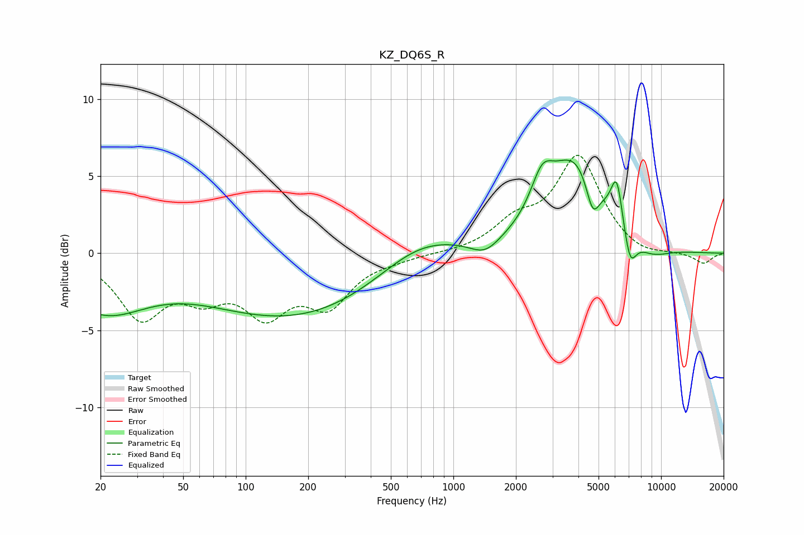

# KZ_DQ6S_R
See [usage instructions](https://github.com/jaakkopasanen/AutoEq#usage) for more options and info.

### Parametric EQs
Apply preamp of -6.1 dB when using parametric equalizer.

|   # | Type    |   Fc (Hz) |    Q |   Gain (dB) |
|-----|---------|-----------|------|-------------|
|   1 | Peaking |        21 | 0.67 |        -3.5 |
|   2 | Peaking |       171 | 0.32 |        -4.1 |
|   3 | Peaking |       683 | 0.7  |         1.8 |
|   4 | Peaking |      1421 | 1.98 |        -1   |
|   5 | Peaking |      2672 | 2.59 |         2.4 |
|   6 | Peaking |      3860 | 1.05 |         5.9 |
|   7 | Peaking |      4687 | 4.3  |        -2.2 |
|   8 | Peaking |      6118 | 4.87 |         3   |
|   9 | Peaking |      7086 | 4.45 |        -2.2 |
|  10 | Peaking |      8958 | 1.46 |        -0.8 |

### Fixed Band EQs
When using fixed band (also called graphic) equalizer, apply preamp of **-6.5 dB** (if available) and set gains manually with these parameters.

|   # | Type    |   Fc (Hz) |    Q |   Gain (dB) |
|-----|---------|-----------|------|-------------|
|   1 | Peaking |        31 | 1.41 |        -3.9 |
|   2 | Peaking |        62 | 1.41 |        -2.2 |
|   3 | Peaking |       125 | 1.41 |        -3.4 |
|   4 | Peaking |       250 | 1.41 |        -3   |
|   5 | Peaking |       500 | 1.41 |        -0.3 |
|   6 | Peaking |      1000 | 1.41 |        -0   |
|   7 | Peaking |      2000 | 1.41 |         1.7 |
|   8 | Peaking |      4000 | 1.41 |         6.1 |
|   9 | Peaking |      8000 | 1.41 |        -0.4 |
|  10 | Peaking |     16000 | 1.41 |        -0.7 |

### Graphs

