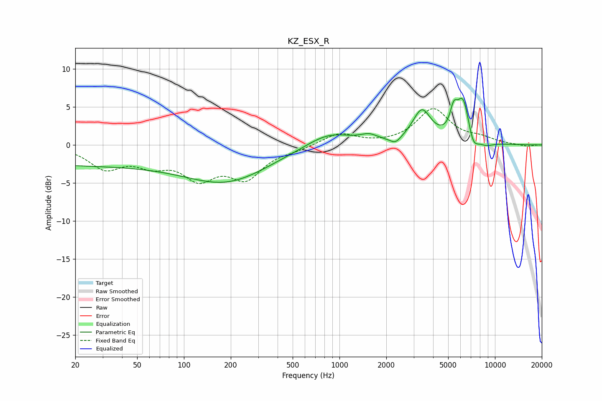

# KZ_ESX_R
See [usage instructions](https://github.com/jaakkopasanen/AutoEq#usage) for more options and info.

### Parametric EQs
Apply preamp of -6.2 dB when using parametric equalizer.

|   # | Type    |   Fc (Hz) |    Q |   Gain (dB) |
|-----|---------|-----------|------|-------------|
|   1 | Peaking |        20 | 0.19 |        -2.6 |
|   2 | Peaking |       192 | 0.52 |        -4.3 |
|   3 | Peaking |       857 | 0.96 |         1.9 |
|   4 | Peaking |      1551 | 2.63 |         0.8 |
|   5 | Peaking |      2294 | 3.99 |        -0.9 |
|   6 | Peaking |      3386 | 2.36 |         4.3 |
|   7 | Peaking |      5423 | 6    |         2.6 |
|   8 | Peaking |      6236 | 3.2  |         5.8 |
|   9 | Peaking |      7224 | 4.05 |        -2.1 |
|  10 | Peaking |      8755 | 2.85 |        -0.5 |

### Fixed Band EQs
When using fixed band (also called graphic) equalizer, apply preamp of **-4.9 dB** (if available) and set gains manually with these parameters.

|   # | Type    |   Fc (Hz) |    Q |   Gain (dB) |
|-----|---------|-----------|------|-------------|
|   1 | Peaking |        31 | 1.41 |        -2.9 |
|   2 | Peaking |        62 | 1.41 |        -2.1 |
|   3 | Peaking |       125 | 1.41 |        -3.9 |
|   4 | Peaking |       250 | 1.41 |        -4   |
|   5 | Peaking |       500 | 1.41 |        -0.5 |
|   6 | Peaking |      1000 | 1.41 |         1.6 |
|   7 | Peaking |      2000 | 1.41 |         0   |
|   8 | Peaking |      4000 | 1.41 |         4.6 |
|   9 | Peaking |      8000 | 1.41 |         0.7 |
|  10 | Peaking |     16000 | 1.41 |        -0.2 |

### Graphs

