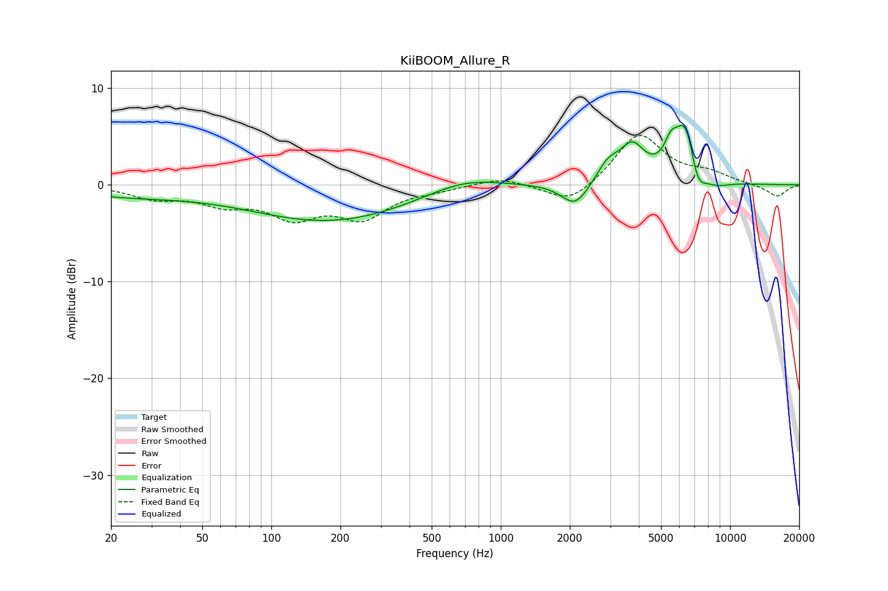

# KiiBOOM_Allure_R
See [usage instructions](https://github.com/jaakkopasanen/AutoEq#usage) for more options and info.

### Parametric EQs
Apply preamp of -6.2 dB when using parametric equalizer.

|   # | Type    |   Fc (Hz) |    Q |   Gain (dB) |
|-----|---------|-----------|------|-------------|
|   1 | Peaking |        23 | 0.52 |        -1   |
|   2 | Peaking |       181 | 0.4  |        -3.7 |
|   3 | Peaking |       690 | 0.87 |         1.4 |
|   4 | Peaking |      2109 | 2.4  |        -2.5 |
|   5 | Peaking |      2929 | 2.97 |         1.8 |
|   6 | Peaking |      3739 | 2.55 |         3.6 |
|   7 | Peaking |      5513 | 4.8  |         2   |
|   8 | Peaking |      6434 | 2.68 |         7.1 |
|   9 | Peaking |      7154 | 3.47 |        -3.7 |
|  10 | Peaking |      8667 | 2.17 |        -0.7 |

### Fixed Band EQs
When using fixed band (also called graphic) equalizer, apply preamp of **-5.2 dB** (if available) and set gains manually with these parameters.

|   # | Type    |   Fc (Hz) |    Q |   Gain (dB) |
|-----|---------|-----------|------|-------------|
|   1 | Peaking |        31 | 1.41 |        -1.2 |
|   2 | Peaking |        62 | 1.41 |        -1.7 |
|   3 | Peaking |       125 | 1.41 |        -3   |
|   4 | Peaking |       250 | 1.41 |        -3.1 |
|   5 | Peaking |       500 | 1.41 |        -0.4 |
|   6 | Peaking |      1000 | 1.41 |         0.8 |
|   7 | Peaking |      2000 | 1.41 |        -2.2 |
|   8 | Peaking |      4000 | 1.41 |         5.3 |
|   9 | Peaking |      8000 | 1.41 |         1   |
|  10 | Peaking |     16000 | 1.41 |        -1.2 |

### Graphs

