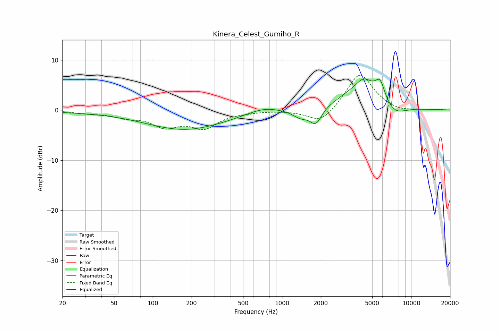

# Kinera_Celest_Gumiho_R
See [usage instructions](https://github.com/jaakkopasanen/AutoEq#usage) for more options and info.

### Parametric EQs
Apply preamp of -6.3 dB when using parametric equalizer.

|   # | Type    |   Fc (Hz) |    Q |   Gain (dB) |
|-----|---------|-----------|------|-------------|
|   1 | Peaking |        54 | 0.18 |        -0.4 |
|   2 | Peaking |       178 | 0.48 |        -3.6 |
|   3 | Peaking |       395 | 0.83 |        -0.1 |
|   4 | Peaking |       721 | 1.16 |         1.1 |
|   5 | Peaking |      1398 | 2.19 |        -1.7 |
|   6 | Peaking |      1833 | 3.09 |        -3.2 |
|   7 | Peaking |      4288 | 3    |         1.3 |
|   8 | Peaking |      4362 | 0.89 |         5.2 |
|   9 | Peaking |      5758 | 3.83 |         3.4 |
|  10 | Peaking |      7331 | 1.47 |        -2.7 |

### Fixed Band EQs
When using fixed band (also called graphic) equalizer, apply preamp of **-7.0 dB** (if available) and set gains manually with these parameters.

|   # | Type    |   Fc (Hz) |    Q |   Gain (dB) |
|-----|---------|-----------|------|-------------|
|   1 | Peaking |        31 | 1.41 |        -0.5 |
|   2 | Peaking |        62 | 1.41 |        -1.2 |
|   3 | Peaking |       125 | 1.41 |        -3   |
|   4 | Peaking |       250 | 1.41 |        -3.2 |
|   5 | Peaking |       500 | 1.41 |        -0.3 |
|   6 | Peaking |      1000 | 1.41 |        -0   |
|   7 | Peaking |      2000 | 1.41 |        -2.9 |
|   8 | Peaking |      4000 | 1.41 |         7.5 |
|   9 | Peaking |      8000 | 1.41 |        -0.6 |
|  10 | Peaking |     16000 | 1.41 |         0.1 |

### Graphs

