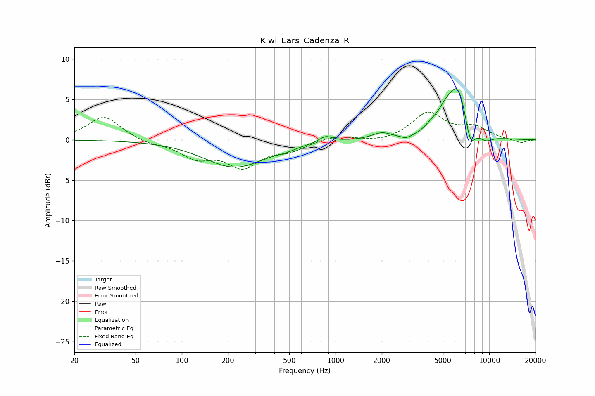

# Kiwi_Ears_Cadenza_R
See [usage instructions](https://github.com/jaakkopasanen/AutoEq#usage) for more options and info.

### Parametric EQs
Apply preamp of -6.4 dB when using parametric equalizer.

|   # | Type    |   Fc (Hz) |    Q |   Gain (dB) |
|-----|---------|-----------|------|-------------|
|   1 | Peaking |       221 | 0.71 |        -3.4 |
|   2 | Peaking |       474 | 2.45 |        -0.3 |
|   3 | Peaking |       863 | 3.33 |         0.8 |
|   4 | Peaking |      1996 | 2.28 |         0.8 |
|   5 | Peaking |      2886 | 3.83 |        -0.4 |
|   6 | Peaking |      4182 | 3.36 |         0.6 |
|   7 | Peaking |      5152 | 2.53 |         1.9 |
|   8 | Peaking |      6269 | 2.18 |         6.1 |
|   9 | Peaking |      7519 | 3.94 |        -3.1 |
|  10 | Peaking |      9503 | 2.94 |        -0.8 |

### Fixed Band EQs
When using fixed band (also called graphic) equalizer, apply preamp of **-3.5 dB** (if available) and set gains manually with these parameters.

|   # | Type    |   Fc (Hz) |    Q |   Gain (dB) |
|-----|---------|-----------|------|-------------|
|   1 | Peaking |        31 | 1.41 |         3   |
|   2 | Peaking |        62 | 1.41 |        -0.5 |
|   3 | Peaking |       125 | 1.41 |        -2   |
|   4 | Peaking |       250 | 1.41 |        -3.1 |
|   5 | Peaking |       500 | 1.41 |        -1.1 |
|   6 | Peaking |      1000 | 1.41 |         0.6 |
|   7 | Peaking |      2000 | 1.41 |        -0.3 |
|   8 | Peaking |      4000 | 1.41 |         3.3 |
|   9 | Peaking |      8000 | 1.41 |         1.4 |
|  10 | Peaking |     16000 | 1.41 |        -0.4 |

### Graphs

