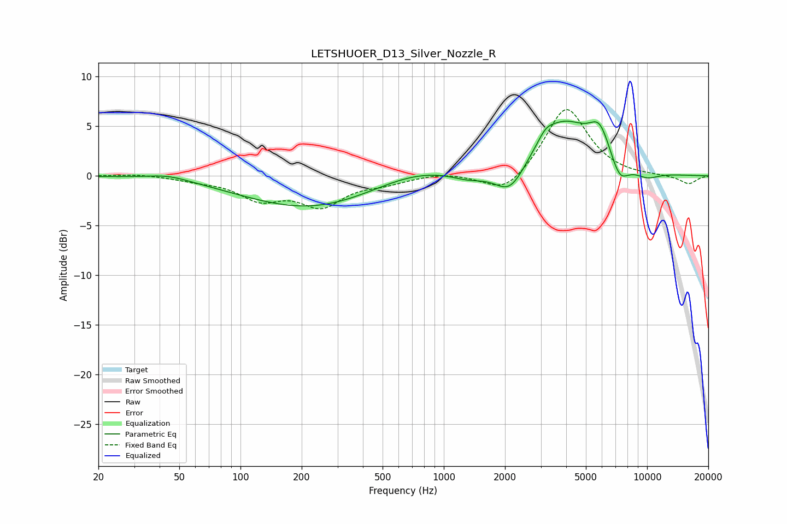

# LETSHUOER_D13_Silver_Nozzle_R
See [usage instructions](https://github.com/jaakkopasanen/AutoEq#usage) for more options and info.

### Parametric EQs
Apply preamp of -5.6 dB when using parametric equalizer.

|   # | Type    |   Fc (Hz) |    Q |   Gain (dB) |
|-----|---------|-----------|------|-------------|
|   1 | Peaking |        44 | 1.37 |         0.5 |
|   2 | Peaking |       221 | 0.43 |        -3.3 |
|   3 | Peaking |       712 | 0.67 |         1.2 |
|   4 | Peaking |      1321 | 1.67 |        -0.7 |
|   5 | Peaking |      2123 | 1.86 |        -3   |
|   6 | Peaking |      3169 | 3.67 |         0.9 |
|   7 | Peaking |      3875 | 0.96 |         5.4 |
|   8 | Peaking |      5845 | 2.67 |         3   |
|   9 | Peaking |      7322 | 3    |        -2.2 |
|  10 | Peaking |      9984 | 1.97 |        -0.8 |

### Fixed Band EQs
When using fixed band (also called graphic) equalizer, apply preamp of **-6.8 dB** (if available) and set gains manually with these parameters.

|   # | Type    |   Fc (Hz) |    Q |   Gain (dB) |
|-----|---------|-----------|------|-------------|
|   1 | Peaking |        31 | 1.41 |         0.2 |
|   2 | Peaking |        62 | 1.41 |        -0.4 |
|   3 | Peaking |       125 | 1.41 |        -2.1 |
|   4 | Peaking |       250 | 1.41 |        -2.8 |
|   5 | Peaking |       500 | 1.41 |        -0.6 |
|   6 | Peaking |      1000 | 1.41 |         0.3 |
|   7 | Peaking |      2000 | 1.41 |        -2.1 |
|   8 | Peaking |      4000 | 1.41 |         7.1 |
|   9 | Peaking |      8000 | 1.41 |        -0.1 |
|  10 | Peaking |     16000 | 1.41 |        -0.8 |

### Graphs

