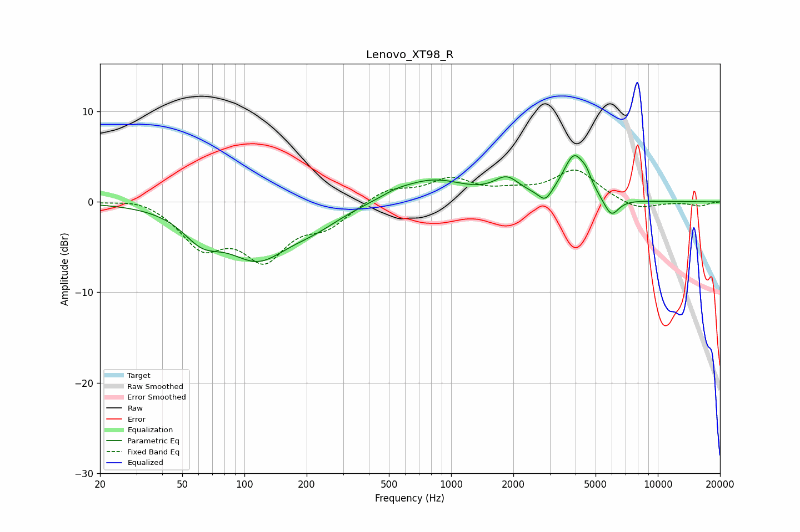

# Lenovo_XT98_R
See [usage instructions](https://github.com/jaakkopasanen/AutoEq#usage) for more options and info.

### Parametric EQs
Apply preamp of -5.2 dB when using parametric equalizer.

|   # | Type    |   Fc (Hz) |    Q |   Gain (dB) |
|-----|---------|-----------|------|-------------|
|   1 | Peaking |        62 | 1.54 |        -2.8 |
|   2 | Peaking |       116 | 0.93 |        -5.6 |
|   3 | Peaking |       218 | 1.05 |        -1.6 |
|   4 | Peaking |       538 | 2.06 |         0.4 |
|   5 | Peaking |       813 | 0.88 |         2.4 |
|   6 | Peaking |      1860 | 2.32 |         2   |
|   7 | Peaking |      2856 | 4.32 |        -1.4 |
|   8 | Peaking |      3943 | 2.59 |         4.9 |
|   9 | Peaking |      4510 | 6    |         0.9 |
|  10 | Peaking |      5948 | 3.72 |        -2.1 |

### Fixed Band EQs
When using fixed band (also called graphic) equalizer, apply preamp of **-3.6 dB** (if available) and set gains manually with these parameters.

|   # | Type    |   Fc (Hz) |    Q |   Gain (dB) |
|-----|---------|-----------|------|-------------|
|   1 | Peaking |        31 | 1.41 |         0.7 |
|   2 | Peaking |        62 | 1.41 |        -4.5 |
|   3 | Peaking |       125 | 1.41 |        -5.7 |
|   4 | Peaking |       250 | 1.41 |        -2.3 |
|   5 | Peaking |       500 | 1.41 |         1.5 |
|   6 | Peaking |      1000 | 1.41 |         2.3 |
|   7 | Peaking |      2000 | 1.41 |         0.8 |
|   8 | Peaking |      4000 | 1.41 |         3.4 |
|   9 | Peaking |      8000 | 1.41 |        -1   |
|  10 | Peaking |     16000 | 1.41 |        -0.4 |

### Graphs

