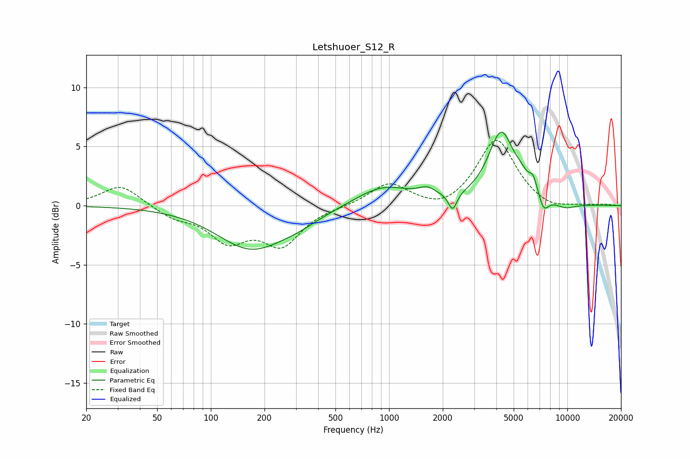

# Letshuoer_S12_R
See [usage instructions](https://github.com/jaakkopasanen/AutoEq#usage) for more options and info.

### Parametric EQs
Apply preamp of -6.3 dB when using parametric equalizer.

|   # | Type    |   Fc (Hz) |    Q |   Gain (dB) |
|-----|---------|-----------|------|-------------|
|   1 | Peaking |       167 | 0.74 |        -3.5 |
|   2 | Peaking |       311 | 1.07 |        -0.7 |
|   3 | Peaking |       926 | 0.93 |         1.7 |
|   4 | Peaking |      1638 | 2.84 |         0.7 |
|   5 | Peaking |      2273 | 5.99 |        -1.5 |
|   6 | Peaking |      4255 | 1.91 |         6   |
|   7 | Peaking |      5504 | 3.64 |         0.7 |
|   8 | Peaking |      6435 | 5.6  |         1.2 |
|   9 | Peaking |      7368 | 4.86 |        -1.3 |
|  10 | Peaking |      9755 | 2.13 |        -0.5 |

### Fixed Band EQs
When using fixed band (also called graphic) equalizer, apply preamp of **-5.6 dB** (if available) and set gains manually with these parameters.

|   # | Type    |   Fc (Hz) |    Q |   Gain (dB) |
|-----|---------|-----------|------|-------------|
|   1 | Peaking |        31 | 1.41 |         1.8 |
|   2 | Peaking |        62 | 1.41 |        -0.9 |
|   3 | Peaking |       125 | 1.41 |        -2.7 |
|   4 | Peaking |       250 | 1.41 |        -3.1 |
|   5 | Peaking |       500 | 1.41 |        -0.1 |
|   6 | Peaking |      1000 | 1.41 |         1.9 |
|   7 | Peaking |      2000 | 1.41 |        -0.7 |
|   8 | Peaking |      4000 | 1.41 |         5.6 |
|   9 | Peaking |      8000 | 1.41 |        -0.5 |
|  10 | Peaking |     16000 | 1.41 |         0.1 |

### Graphs

