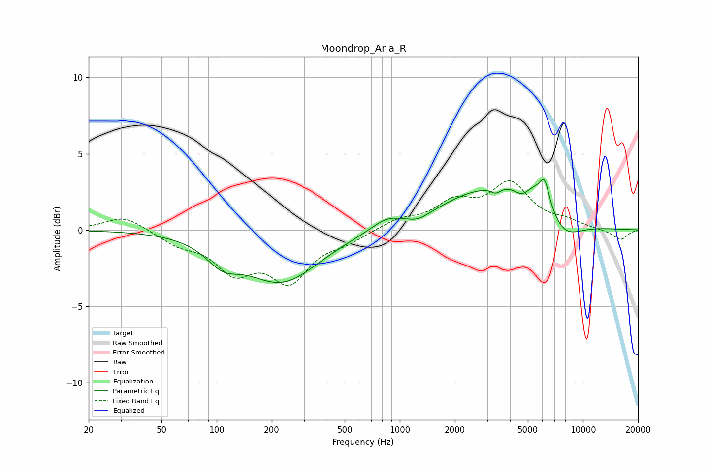

# Moondrop_Aria_R
See [usage instructions](https://github.com/jaakkopasanen/AutoEq#usage) for more options and info.

### Parametric EQs
Apply preamp of -3.4 dB when using parametric equalizer.

|   # | Type    |   Fc (Hz) |    Q |   Gain (dB) |
|-----|---------|-----------|------|-------------|
|   1 | Peaking |       108 | 1.59 |        -1.3 |
|   2 | Peaking |       227 | 0.71 |        -3.3 |
|   3 | Peaking |       844 | 1.67 |         0.7 |
|   4 | Peaking |      1264 | 2.47 |        -0.4 |
|   5 | Peaking |      2556 | 0.66 |         1.9 |
|   6 | Peaking |      3341 | 5.5  |        -0.4 |
|   7 | Peaking |      4671 | 2.98 |        -1   |
|   8 | Peaking |      5552 | 0.96 |         3.4 |
|   9 | Peaking |      6171 | 5.69 |         1.4 |
|  10 | Peaking |      7551 | 1.25 |        -2.4 |

### Fixed Band EQs
When using fixed band (also called graphic) equalizer, apply preamp of **-3.3 dB** (if available) and set gains manually with these parameters.

|   # | Type    |   Fc (Hz) |    Q |   Gain (dB) |
|-----|---------|-----------|------|-------------|
|   1 | Peaking |        31 | 1.41 |         1   |
|   2 | Peaking |        62 | 1.41 |        -0.8 |
|   3 | Peaking |       125 | 1.41 |        -2.4 |
|   4 | Peaking |       250 | 1.41 |        -3.1 |
|   5 | Peaking |       500 | 1.41 |        -0.6 |
|   6 | Peaking |      1000 | 1.41 |         0.6 |
|   7 | Peaking |      2000 | 1.41 |         1.6 |
|   8 | Peaking |      4000 | 1.41 |         2.9 |
|   9 | Peaking |      8000 | 1.41 |         0.5 |
|  10 | Peaking |     16000 | 1.41 |        -0.7 |

### Graphs

