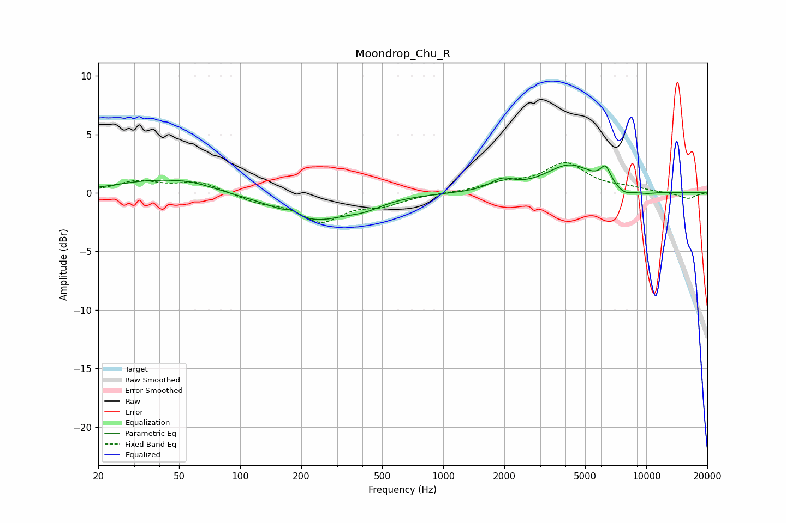

# Moondrop_Chu_R
See [usage instructions](https://github.com/jaakkopasanen/AutoEq#usage) for more options and info.

### Parametric EQs
Apply preamp of -2.5 dB when using parametric equalizer.

|   # | Type    |   Fc (Hz) |    Q |   Gain (dB) |
|-----|---------|-----------|------|-------------|
|   1 | Peaking |        35 | 0.81 |         0.8 |
|   2 | Peaking |        57 | 1.12 |         0.6 |
|   3 | Peaking |       181 | 4.77 |         0.4 |
|   4 | Peaking |       230 | 0.83 |        -2.3 |
|   5 | Peaking |       413 | 1.62 |        -0.6 |
|   6 | Peaking |      1949 | 2.53 |         0.9 |
|   7 | Peaking |      4197 | 1.16 |         2.3 |
|   8 | Peaking |      6305 | 5.26 |         1.4 |
|   9 | Peaking |      7803 | 2.91 |        -0.6 |
|  10 | Peaking |     10000 | 2.22 |        -0.2 |

### Fixed Band EQs
When using fixed band (also called graphic) equalizer, apply preamp of **-2.7 dB** (if available) and set gains manually with these parameters.

|   # | Type    |   Fc (Hz) |    Q |   Gain (dB) |
|-----|---------|-----------|------|-------------|
|   1 | Peaking |        31 | 1.41 |         0.9 |
|   2 | Peaking |        62 | 1.41 |         0.9 |
|   3 | Peaking |       125 | 1.41 |        -0.7 |
|   4 | Peaking |       250 | 1.41 |        -2.3 |
|   5 | Peaking |       500 | 1.41 |        -0.9 |
|   6 | Peaking |      1000 | 1.41 |        -0   |
|   7 | Peaking |      2000 | 1.41 |         0.7 |
|   8 | Peaking |      4000 | 1.41 |         2.4 |
|   9 | Peaking |      8000 | 1.41 |         0.3 |
|  10 | Peaking |     16000 | 1.41 |        -0.5 |

### Graphs

