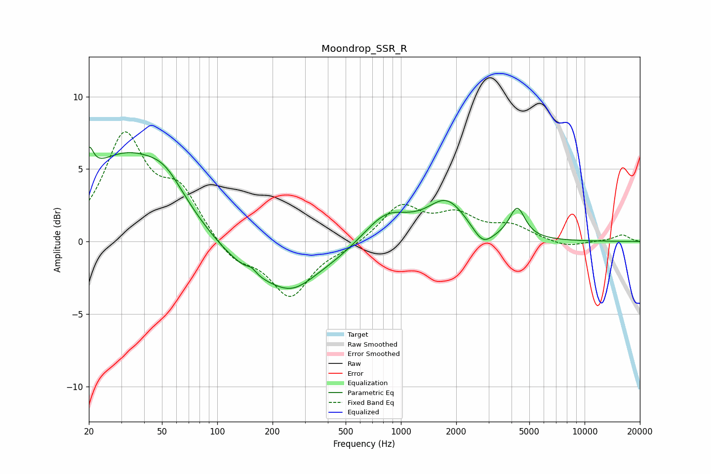

# Moondrop_SSR_R
See [usage instructions](https://github.com/jaakkopasanen/AutoEq#usage) for more options and info.

### Parametric EQs
Apply preamp of -6.6 dB when using parametric equalizer.

|   # | Type    |   Fc (Hz) |    Q |   Gain (dB) |
|-----|---------|-----------|------|-------------|
|   1 | Peaking |        20 | 6    |         1.8 |
|   2 | Peaking |        33 | 0.51 |         6.1 |
|   3 | Peaking |        52 | 1.53 |         1.2 |
|   4 | Peaking |       154 | 5.86 |         0.3 |
|   5 | Peaking |       201 | 0.47 |        -3.3 |
|   6 | Peaking |       260 | 1.51 |        -0.7 |
|   7 | Peaking |       830 | 1.11 |         2.2 |
|   8 | Peaking |      1777 | 1.31 |         2.6 |
|   9 | Peaking |      2793 | 2.6  |        -1.2 |
|  10 | Peaking |      4298 | 3.31 |         2.1 |

### Fixed Band EQs
When using fixed band (also called graphic) equalizer, apply preamp of **-7.7 dB** (if available) and set gains manually with these parameters.

|   # | Type    |   Fc (Hz) |    Q |   Gain (dB) |
|-----|---------|-----------|------|-------------|
|   1 | Peaking |        31 | 1.41 |         7.1 |
|   2 | Peaking |        62 | 1.41 |         3.1 |
|   3 | Peaking |       125 | 1.41 |        -1.4 |
|   4 | Peaking |       250 | 1.41 |        -3.7 |
|   5 | Peaking |       500 | 1.41 |        -0.4 |
|   6 | Peaking |      1000 | 1.41 |         2.4 |
|   7 | Peaking |      2000 | 1.41 |         1.6 |
|   8 | Peaking |      4000 | 1.41 |         1   |
|   9 | Peaking |      8000 | 1.41 |        -0.4 |
|  10 | Peaking |     16000 | 1.41 |         0.5 |

### Graphs

