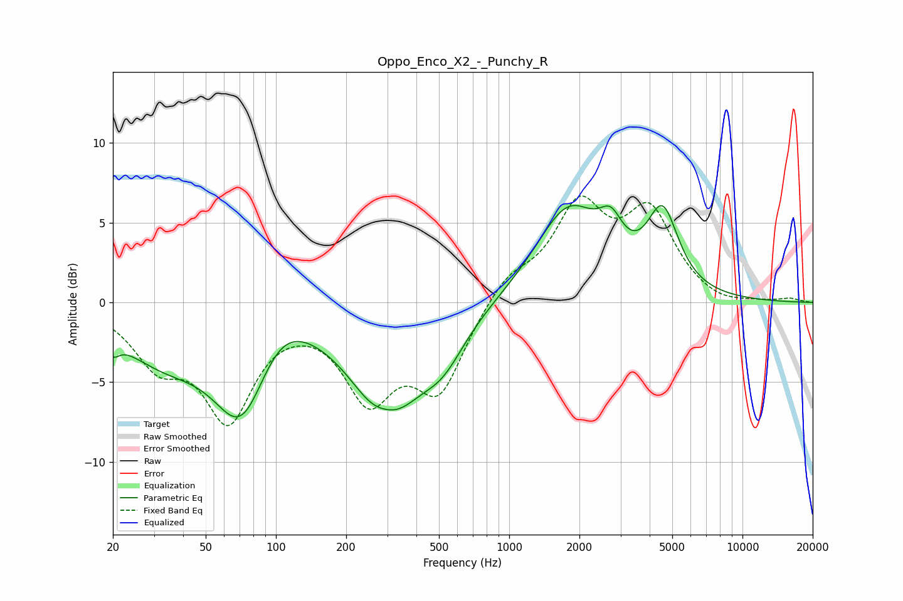

# Oppo_Enco_X2_-_Punchy_R
See [usage instructions](https://github.com/jaakkopasanen/AutoEq#usage) for more options and info.

### Parametric EQs
Apply preamp of -6.2 dB when using parametric equalizer.

|   # | Type    |   Fc (Hz) |    Q |   Gain (dB) |
|-----|---------|-----------|------|-------------|
|   1 | Peaking |        20 | 5.4  |        -1   |
|   2 | Peaking |        33 | 0.71 |        -3.1 |
|   3 | Peaking |        72 | 1.17 |        -6.8 |
|   4 | Peaking |       101 | 1.13 |         2.5 |
|   5 | Peaking |       296 | 2.13 |         1   |
|   6 | Peaking |       296 | 0.99 |        -7.2 |
|   7 | Peaking |       520 | 1.42 |        -2.3 |
|   8 | Peaking |      1796 | 0.99 |         5.8 |
|   9 | Peaking |      2730 | 2.86 |         2   |
|  10 | Peaking |      4549 | 2.09 |         4.9 |

### Fixed Band EQs
When using fixed band (also called graphic) equalizer, apply preamp of **-6.8 dB** (if available) and set gains manually with these parameters.

|   # | Type    |   Fc (Hz) |    Q |   Gain (dB) |
|-----|---------|-----------|------|-------------|
|   1 | Peaking |        31 | 1.41 |        -3.3 |
|   2 | Peaking |        62 | 1.41 |        -6.9 |
|   3 | Peaking |       125 | 1.41 |        -0.1 |
|   4 | Peaking |       250 | 1.41 |        -5.5 |
|   5 | Peaking |       500 | 1.41 |        -5.2 |
|   6 | Peaking |      1000 | 1.41 |         1.6 |
|   7 | Peaking |      2000 | 1.41 |         5.7 |
|   8 | Peaking |      4000 | 1.41 |         5.3 |
|   9 | Peaking |      8000 | 1.41 |        -0.4 |
|  10 | Peaking |     16000 | 1.41 |         0.2 |

### Graphs

