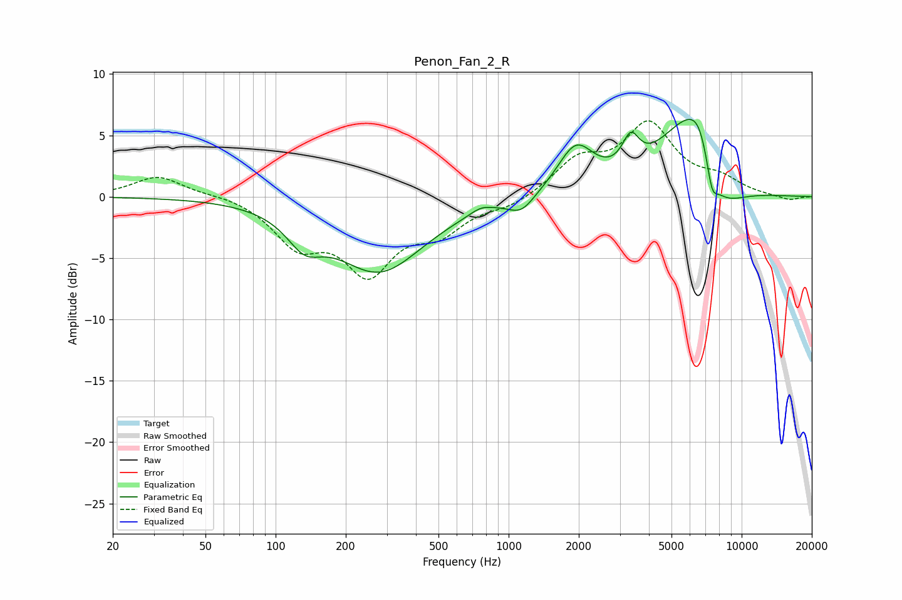

# Penon_Fan_2_R
See [usage instructions](https://github.com/jaakkopasanen/AutoEq#usage) for more options and info.

### Parametric EQs
Apply preamp of -6.4 dB when using parametric equalizer.

|   # | Type    |   Fc (Hz) |    Q |   Gain (dB) |
|-----|---------|-----------|------|-------------|
|   1 | Peaking |       133 | 1.91 |        -2.3 |
|   2 | Peaking |       278 | 0.74 |        -6   |
|   3 | Peaking |       761 | 2.99 |         0.5 |
|   4 | Peaking |      1135 | 2.51 |        -1.3 |
|   5 | Peaking |      1943 | 1.82 |         3.8 |
|   6 | Peaking |      3342 | 3.92 |         2.5 |
|   7 | Peaking |      5814 | 1.02 |         6.7 |
|   8 | Peaking |      6635 | 2.37 |         3.7 |
|   9 | Peaking |      7453 | 6    |        -1.9 |
|  10 | Peaking |      7647 | 1.27 |        -4.8 |

### Fixed Band EQs
When using fixed band (also called graphic) equalizer, apply preamp of **-6.3 dB** (if available) and set gains manually with these parameters.

|   # | Type    |   Fc (Hz) |    Q |   Gain (dB) |
|-----|---------|-----------|------|-------------|
|   1 | Peaking |        31 | 1.41 |         1.7 |
|   2 | Peaking |        62 | 1.41 |         0.2 |
|   3 | Peaking |       125 | 1.41 |        -3.5 |
|   4 | Peaking |       250 | 1.41 |        -5.7 |
|   5 | Peaking |       500 | 1.41 |        -2.5 |
|   6 | Peaking |      1000 | 1.41 |        -0.8 |
|   7 | Peaking |      2000 | 1.41 |         2.7 |
|   8 | Peaking |      4000 | 1.41 |         5.6 |
|   9 | Peaking |      8000 | 1.41 |         1.2 |
|  10 | Peaking |     16000 | 1.41 |        -0.3 |

### Graphs

