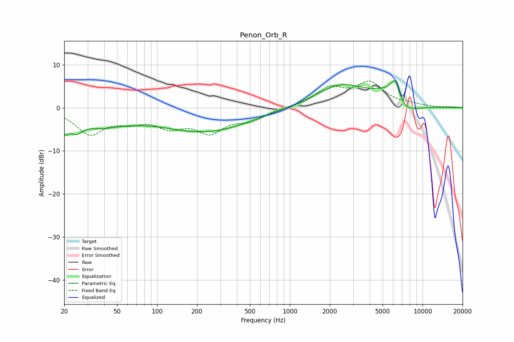

# Penon_Orb_R
See [usage instructions](https://github.com/jaakkopasanen/AutoEq#usage) for more options and info.

### Parametric EQs
Apply preamp of -6.4 dB when using parametric equalizer.

|   # | Type    |   Fc (Hz) |    Q |   Gain (dB) |
|-----|---------|-----------|------|-------------|
|   1 | Peaking |        20 | 4.71 |        -3.3 |
|   2 | Peaking |        25 | 2.82 |        -3   |
|   3 | Peaking |        37 | 1.01 |        -2.6 |
|   4 | Peaking |       103 | 0.8  |         1.2 |
|   5 | Peaking |       133 | 0.39 |        -4.7 |
|   6 | Peaking |       334 | 0.53 |        -2.3 |
|   7 | Peaking |      2410 | 0.76 |         5.1 |
|   8 | Peaking |      5941 | 1.05 |         5.3 |
|   9 | Peaking |      6216 | 4.14 |         4.4 |
|  10 | Peaking |      7051 | 1.27 |        -5.4 |

### Fixed Band EQs
When using fixed band (also called graphic) equalizer, apply preamp of **-6.3 dB** (if available) and set gains manually with these parameters.

|   # | Type    |   Fc (Hz) |    Q |   Gain (dB) |
|-----|---------|-----------|------|-------------|
|   1 | Peaking |        31 | 1.41 |        -5.8 |
|   2 | Peaking |        62 | 1.41 |        -2.3 |
|   3 | Peaking |       125 | 1.41 |        -3.7 |
|   4 | Peaking |       250 | 1.41 |        -5.1 |
|   5 | Peaking |       500 | 1.41 |        -2.5 |
|   6 | Peaking |      1000 | 1.41 |         0   |
|   7 | Peaking |      2000 | 1.41 |         4.2 |
|   8 | Peaking |      4000 | 1.41 |         5.4 |
|   9 | Peaking |      8000 | 1.41 |         0.5 |
|  10 | Peaking |     16000 | 1.41 |         0.2 |

### Graphs

