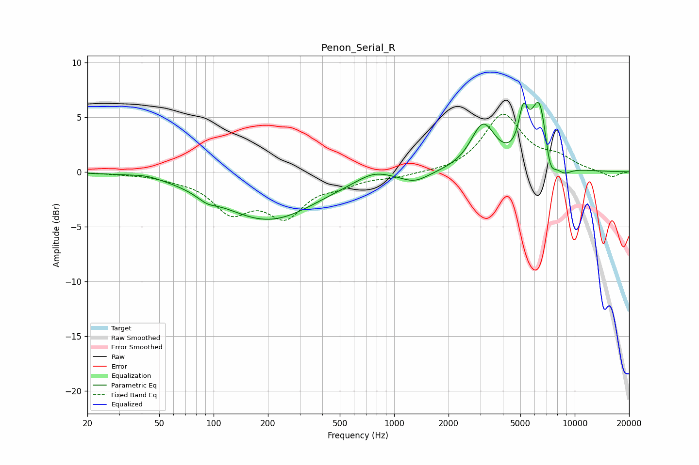

# Penon_Serial_R
See [usage instructions](https://github.com/jaakkopasanen/AutoEq#usage) for more options and info.

### Parametric EQs
Apply preamp of -6.5 dB when using parametric equalizer.

|   # | Type    |   Fc (Hz) |    Q |   Gain (dB) |
|-----|---------|-----------|------|-------------|
|   1 | Peaking |        43 | 1.79 |         0.3 |
|   2 | Peaking |        92 | 2.67 |        -0.6 |
|   3 | Peaking |       201 | 0.53 |        -4.3 |
|   4 | Peaking |       767 | 1.53 |         0.8 |
|   5 | Peaking |      1301 | 1.82 |        -0.9 |
|   6 | Peaking |      3104 | 2.08 |         4.1 |
|   7 | Peaking |      5190 | 5.33 |         3.6 |
|   8 | Peaking |      6397 | 2.87 |         6.6 |
|   9 | Peaking |      7270 | 4.16 |        -2.9 |
|  10 | Peaking |      8681 | 2.91 |        -0.8 |

### Fixed Band EQs
When using fixed band (also called graphic) equalizer, apply preamp of **-5.4 dB** (if available) and set gains manually with these parameters.

|   # | Type    |   Fc (Hz) |    Q |   Gain (dB) |
|-----|---------|-----------|------|-------------|
|   1 | Peaking |        31 | 1.41 |        -0.1 |
|   2 | Peaking |        62 | 1.41 |        -0.4 |
|   3 | Peaking |       125 | 1.41 |        -3.3 |
|   4 | Peaking |       250 | 1.41 |        -3.6 |
|   5 | Peaking |       500 | 1.41 |        -0.9 |
|   6 | Peaking |      1000 | 1.41 |        -0.4 |
|   7 | Peaking |      2000 | 1.41 |        -0.1 |
|   8 | Peaking |      4000 | 1.41 |         5.2 |
|   9 | Peaking |      8000 | 1.41 |         1.1 |
|  10 | Peaking |     16000 | 1.41 |        -0.5 |

### Graphs

