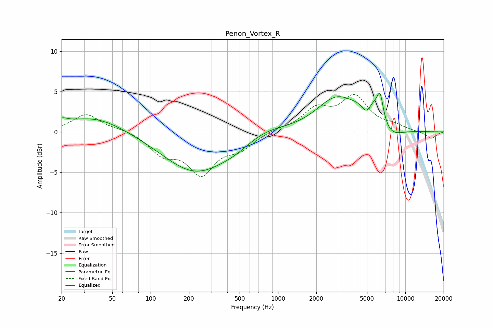

# Penon_Vortex_R
See [usage instructions](https://github.com/jaakkopasanen/AutoEq#usage) for more options and info.

### Parametric EQs
Apply preamp of -4.9 dB when using parametric equalizer.

|   # | Type    |   Fc (Hz) |    Q |   Gain (dB) |
|-----|---------|-----------|------|-------------|
|   1 | Peaking |        20 | 3.12 |         0.7 |
|   2 | Peaking |        36 | 0.62 |         1.9 |
|   3 | Peaking |       227 | 0.55 |        -5   |
|   4 | Peaking |       474 | 1.19 |        -0.6 |
|   5 | Peaking |       776 | 0.84 |         0.9 |
|   6 | Peaking |      2834 | 0.92 |         3.7 |
|   7 | Peaking |      4955 | 3.55 |        -1.9 |
|   8 | Peaking |      5741 | 1.24 |         5   |
|   9 | Peaking |      6339 | 5.79 |         2.6 |
|  10 | Peaking |      7131 | 1.29 |        -3.5 |

### Fixed Band EQs
When using fixed band (also called graphic) equalizer, apply preamp of **-4.7 dB** (if available) and set gains manually with these parameters.

|   # | Type    |   Fc (Hz) |    Q |   Gain (dB) |
|-----|---------|-----------|------|-------------|
|   1 | Peaking |        31 | 1.41 |         2.2 |
|   2 | Peaking |        62 | 1.41 |         0.3 |
|   3 | Peaking |       125 | 1.41 |        -2.4 |
|   4 | Peaking |       250 | 1.41 |        -4.8 |
|   5 | Peaking |       500 | 1.41 |        -1.8 |
|   6 | Peaking |      1000 | 1.41 |         0.3 |
|   7 | Peaking |      2000 | 1.41 |         2.6 |
|   8 | Peaking |      4000 | 1.41 |         4.1 |
|   9 | Peaking |      8000 | 1.41 |         0.6 |
|  10 | Peaking |     16000 | 1.41 |        -0.9 |

### Graphs

