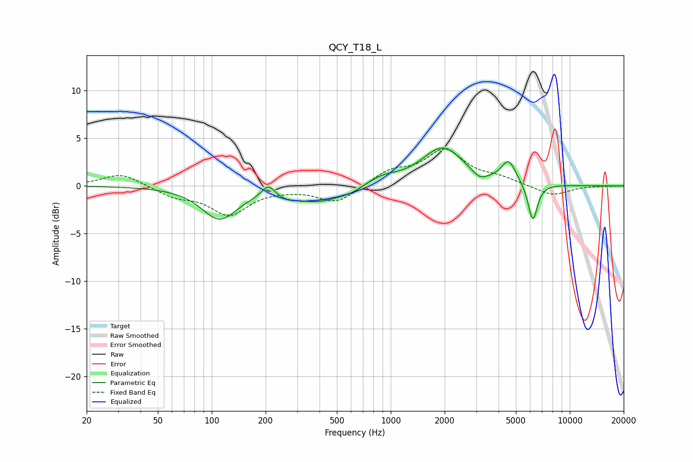

# QCY_T18_L
See [usage instructions](https://github.com/jaakkopasanen/AutoEq#usage) for more options and info.

### Parametric EQs
Apply preamp of -4.1 dB when using parametric equalizer.

|   # | Type    |   Fc (Hz) |    Q |   Gain (dB) |
|-----|---------|-----------|------|-------------|
|   1 | Peaking |       111 | 1.43 |        -3.4 |
|   2 | Peaking |       207 | 4.05 |         1.3 |
|   3 | Peaking |       264 | 2.87 |        -0.4 |
|   4 | Peaking |       395 | 0.98 |        -1.6 |
|   5 | Peaking |       600 | 2.25 |        -0.4 |
|   6 | Peaking |       893 | 1.56 |         0.8 |
|   7 | Peaking |      1952 | 1.21 |         4   |
|   8 | Peaking |      3131 | 3.28 |        -0.8 |
|   9 | Peaking |      4555 | 3.48 |         2.3 |
|  10 | Peaking |      6211 | 5.29 |        -4   |

### Fixed Band EQs
When using fixed band (also called graphic) equalizer, apply preamp of **-4.0 dB** (if available) and set gains manually with these parameters.

|   # | Type    |   Fc (Hz) |    Q |   Gain (dB) |
|-----|---------|-----------|------|-------------|
|   1 | Peaking |        31 | 1.41 |         1.4 |
|   2 | Peaking |        62 | 1.41 |        -1   |
|   3 | Peaking |       125 | 1.41 |        -2.9 |
|   4 | Peaking |       250 | 1.41 |        -0.2 |
|   5 | Peaking |       500 | 1.41 |        -1.8 |
|   6 | Peaking |      1000 | 1.41 |         1.5 |
|   7 | Peaking |      2000 | 1.41 |         3.6 |
|   8 | Peaking |      4000 | 1.41 |         0.7 |
|   9 | Peaking |      8000 | 1.41 |        -1.1 |
|  10 | Peaking |     16000 | 1.41 |        -0   |

### Graphs

