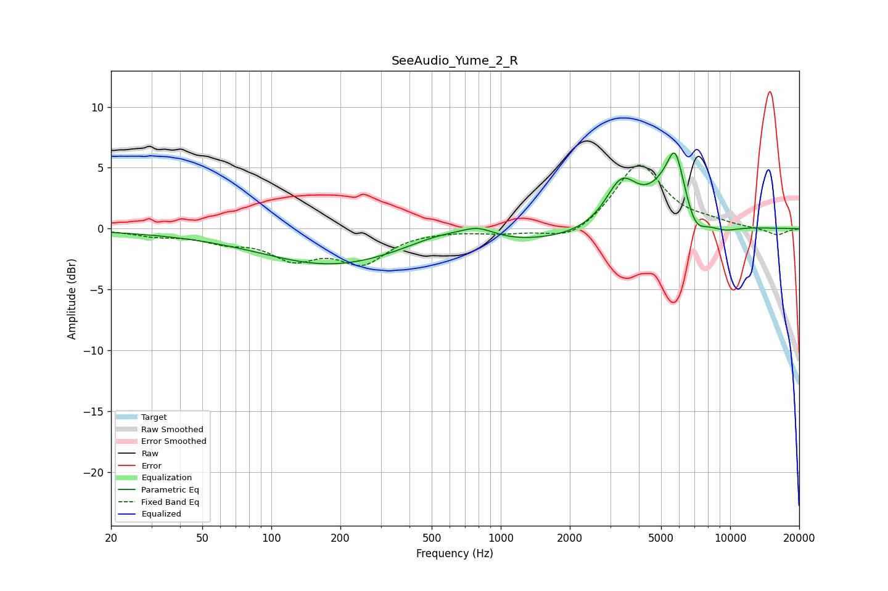

# SeeAudio_Yume_2_R
See [usage instructions](https://github.com/jaakkopasanen/AutoEq#usage) for more options and info.

### Parametric EQs
Apply preamp of -6.3 dB when using parametric equalizer.

|   # | Type    |   Fc (Hz) |    Q |   Gain (dB) |
|-----|---------|-----------|------|-------------|
|   1 | Peaking |       117 | 0.18 |        -0.4 |
|   2 | Peaking |       181 | 0.48 |        -2.5 |
|   3 | Peaking |       549 | 0.95 |         1.1 |
|   4 | Peaking |       797 | 1.91 |         0.9 |
|   5 | Peaking |      1233 | 0.36 |        -1.1 |
|   6 | Peaking |      3358 | 2.01 |         3.7 |
|   7 | Peaking |      5748 | 5.2  |         1.9 |
|   8 | Peaking |      5881 | 1.58 |         5.9 |
|   9 | Peaking |      6918 | 2.43 |        -3.5 |
|  10 | Peaking |      9272 | 1.71 |        -0.7 |

### Fixed Band EQs
When using fixed band (also called graphic) equalizer, apply preamp of **-5.3 dB** (if available) and set gains manually with these parameters.

|   # | Type    |   Fc (Hz) |    Q |   Gain (dB) |
|-----|---------|-----------|------|-------------|
|   1 | Peaking |        31 | 1.41 |        -0.5 |
|   2 | Peaking |        62 | 1.41 |        -0.9 |
|   3 | Peaking |       125 | 1.41 |        -2.2 |
|   4 | Peaking |       250 | 1.41 |        -2.6 |
|   5 | Peaking |       500 | 1.41 |        -0   |
|   6 | Peaking |      1000 | 1.41 |        -0.3 |
|   7 | Peaking |      2000 | 1.41 |        -1.1 |
|   8 | Peaking |      4000 | 1.41 |         5.4 |
|   9 | Peaking |      8000 | 1.41 |         0.4 |
|  10 | Peaking |     16000 | 1.41 |        -0.6 |

### Graphs

