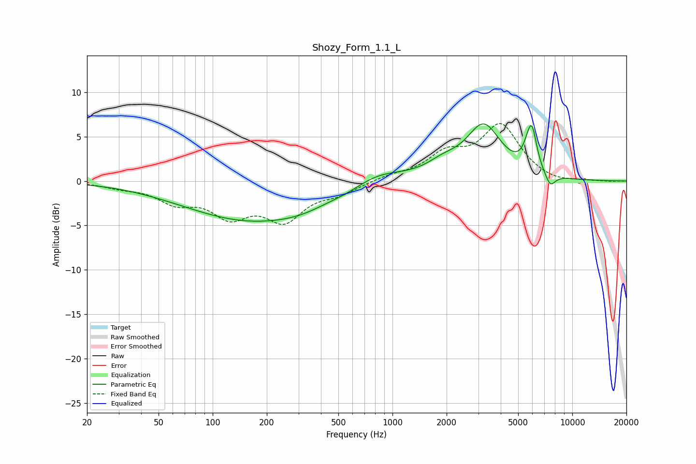

# Shozy_Form_1.1_L
See [usage instructions](https://github.com/jaakkopasanen/AutoEq#usage) for more options and info.

### Parametric EQs
Apply preamp of -6.5 dB when using parametric equalizer.

|   # | Type    |   Fc (Hz) |    Q |   Gain (dB) |
|-----|---------|-----------|------|-------------|
|   1 | Peaking |        57 | 0.68 |        -0.1 |
|   2 | Peaking |       165 | 0.39 |        -4.3 |
|   3 | Peaking |       310 | 1    |        -0.6 |
|   4 | Peaking |       585 | 1.26 |        -0.5 |
|   5 | Peaking |       803 | 0.93 |         1.5 |
|   6 | Peaking |      1912 | 1.52 |         1.3 |
|   7 | Peaking |      3217 | 1.45 |         6   |
|   8 | Peaking |      5718 | 4.47 |         1.8 |
|   9 | Peaking |      5987 | 5.25 |         3.6 |
|  10 | Peaking |      7542 | 4.75 |        -1.5 |

### Fixed Band EQs
When using fixed band (also called graphic) equalizer, apply preamp of **-6.6 dB** (if available) and set gains manually with these parameters.

|   # | Type    |   Fc (Hz) |    Q |   Gain (dB) |
|-----|---------|-----------|------|-------------|
|   1 | Peaking |        31 | 1.41 |        -0.5 |
|   2 | Peaking |        62 | 1.41 |        -2.1 |
|   3 | Peaking |       125 | 1.41 |        -3.4 |
|   4 | Peaking |       250 | 1.41 |        -4   |
|   5 | Peaking |       500 | 1.41 |        -1.2 |
|   6 | Peaking |      1000 | 1.41 |         0.5 |
|   7 | Peaking |      2000 | 1.41 |         2.7 |
|   8 | Peaking |      4000 | 1.41 |         6.1 |
|   9 | Peaking |      8000 | 1.41 |        -0.4 |
|  10 | Peaking |     16000 | 1.41 |        -0.1 |

### Graphs

