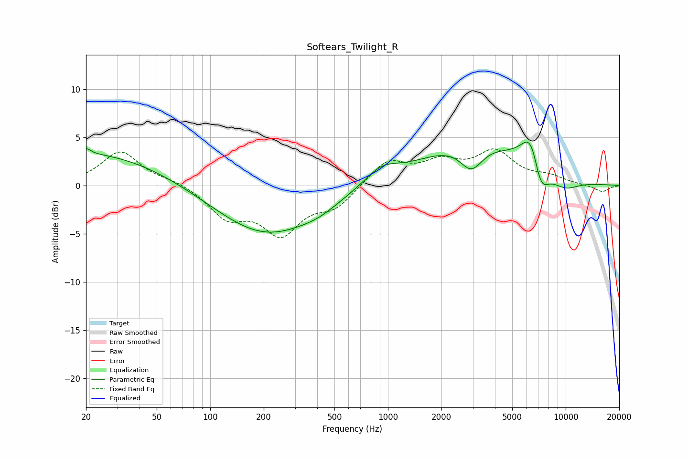

# Softears_Twilight_R
See [usage instructions](https://github.com/jaakkopasanen/AutoEq#usage) for more options and info.

### Parametric EQs
Apply preamp of -4.6 dB when using parametric equalizer.

|   # | Type    |   Fc (Hz) |    Q |   Gain (dB) |
|-----|---------|-----------|------|-------------|
|   1 | Peaking |        20 | 0.31 |         3.5 |
|   2 | Peaking |        20 | 5.92 |         0.5 |
|   3 | Peaking |       207 | 0.49 |        -5.2 |
|   4 | Peaking |       408 | 1.42 |        -0.5 |
|   5 | Peaking |       917 | 1.46 |         1.7 |
|   6 | Peaking |      2946 | 2.16 |        -2.8 |
|   7 | Peaking |      3013 | 0.49 |         4.5 |
|   8 | Peaking |      6438 | 2.45 |         4.4 |
|   9 | Peaking |      7178 | 2.88 |        -3.9 |
|  10 | Peaking |      9838 | 1.5  |        -1.2 |

### Fixed Band EQs
When using fixed band (also called graphic) equalizer, apply preamp of **-3.9 dB** (if available) and set gains manually with these parameters.

|   # | Type    |   Fc (Hz) |    Q |   Gain (dB) |
|-----|---------|-----------|------|-------------|
|   1 | Peaking |        31 | 1.41 |         3.5 |
|   2 | Peaking |        62 | 1.41 |         0.5 |
|   3 | Peaking |       125 | 1.41 |        -3   |
|   4 | Peaking |       250 | 1.41 |        -4.6 |
|   5 | Peaking |       500 | 1.41 |        -2.1 |
|   6 | Peaking |      1000 | 1.41 |         2.6 |
|   7 | Peaking |      2000 | 1.41 |         2.1 |
|   8 | Peaking |      4000 | 1.41 |         3.3 |
|   9 | Peaking |      8000 | 1.41 |         0.8 |
|  10 | Peaking |     16000 | 1.41 |        -0.7 |

### Graphs

