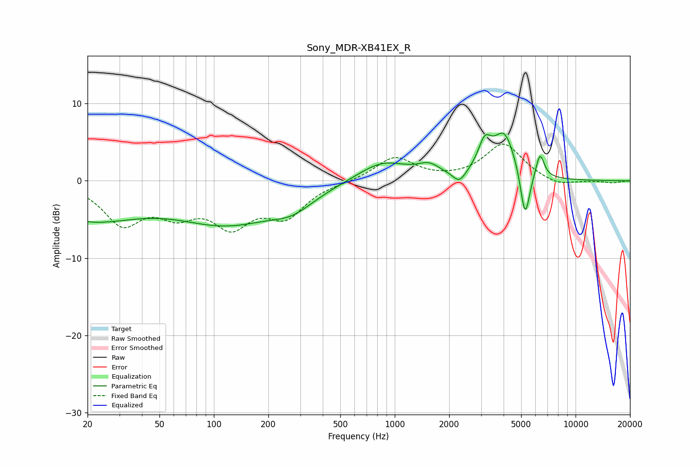

# Sony_MDR-XB41EX_R
See [usage instructions](https://github.com/jaakkopasanen/AutoEq#usage) for more options and info.

### Parametric EQs
Apply preamp of -6.3 dB when using parametric equalizer.

|   # | Type    |   Fc (Hz) |    Q |   Gain (dB) |
|-----|---------|-----------|------|-------------|
|   1 | Peaking |        20 | 0.51 |        -4.7 |
|   2 | Peaking |       120 | 0.49 |        -5.1 |
|   3 | Peaking |       273 | 1.21 |        -1.8 |
|   4 | Peaking |       860 | 1    |         2.6 |
|   5 | Peaking |      1546 | 2.39 |         1.3 |
|   6 | Peaking |      2275 | 4.05 |        -1.5 |
|   7 | Peaking |      3141 | 3.88 |         3.5 |
|   8 | Peaking |      4039 | 2.23 |         5.9 |
|   9 | Peaking |      5260 | 5.38 |        -6.6 |
|  10 | Peaking |      6359 | 5.98 |         3.2 |

### Fixed Band EQs
When using fixed band (also called graphic) equalizer, apply preamp of **-4.8 dB** (if available) and set gains manually with these parameters.

|   # | Type    |   Fc (Hz) |    Q |   Gain (dB) |
|-----|---------|-----------|------|-------------|
|   1 | Peaking |        31 | 1.41 |        -5.2 |
|   2 | Peaking |        62 | 1.41 |        -3.4 |
|   3 | Peaking |       125 | 1.41 |        -5.1 |
|   4 | Peaking |       250 | 1.41 |        -4.1 |
|   5 | Peaking |       500 | 1.41 |        -0.1 |
|   6 | Peaking |      1000 | 1.41 |         3.1 |
|   7 | Peaking |      2000 | 1.41 |         0   |
|   8 | Peaking |      4000 | 1.41 |         4.8 |
|   9 | Peaking |      8000 | 1.41 |        -0.8 |
|  10 | Peaking |     16000 | 1.41 |        -0.3 |

### Graphs

