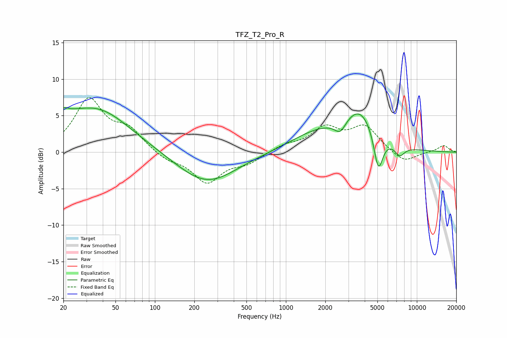

# TFZ_T2_Pro_R
See [usage instructions](https://github.com/jaakkopasanen/AutoEq#usage) for more options and info.

### Parametric EQs
Apply preamp of -6.2 dB when using parametric equalizer.

|   # | Type    |   Fc (Hz) |    Q |   Gain (dB) |
|-----|---------|-----------|------|-------------|
|   1 | Peaking |        20 | 5.38 |         3.5 |
|   2 | Peaking |        20 | 5.94 |        -2.3 |
|   3 | Peaking |        22 | 1.47 |         1   |
|   4 | Peaking |        36 | 0.55 |         5.9 |
|   5 | Peaking |       248 | 0.63 |        -4.3 |
|   6 | Peaking |      1729 | 0.67 |         2.4 |
|   7 | Peaking |      2602 | 3.27 |        -1.7 |
|   8 | Peaking |      3696 | 1.09 |         5.1 |
|   9 | Peaking |      5079 | 3.91 |        -5.5 |
|  10 | Peaking |      7394 | 3.6  |        -1.4 |

### Fixed Band EQs
When using fixed band (also called graphic) equalizer, apply preamp of **-7.6 dB** (if available) and set gains manually with these parameters.

|   # | Type    |   Fc (Hz) |    Q |   Gain (dB) |
|-----|---------|-----------|------|-------------|
|   1 | Peaking |        31 | 1.41 |         7   |
|   2 | Peaking |        62 | 1.41 |         2.7 |
|   3 | Peaking |       125 | 1.41 |        -1   |
|   4 | Peaking |       250 | 1.41 |        -4   |
|   5 | Peaking |       500 | 1.41 |        -1.3 |
|   6 | Peaking |      1000 | 1.41 |         0.9 |
|   7 | Peaking |      2000 | 1.41 |         3.1 |
|   8 | Peaking |      4000 | 1.41 |         3.4 |
|   9 | Peaking |      8000 | 1.41 |        -1.5 |
|  10 | Peaking |     16000 | 1.41 |         0.9 |

### Graphs

