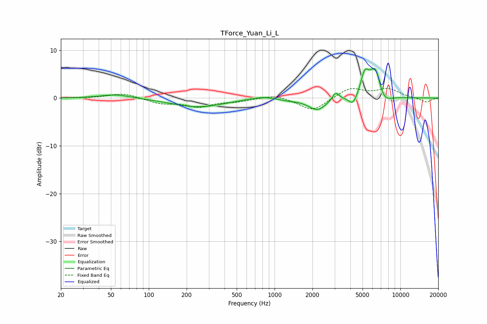

# TForce_Yuan_Li_L
See [usage instructions](https://github.com/jaakkopasanen/AutoEq#usage) for more options and info.

### Parametric EQs
Apply preamp of -6.3 dB when using parametric equalizer.

|   # | Type    |   Fc (Hz) |    Q |   Gain (dB) |
|-----|---------|-----------|------|-------------|
|   1 | Peaking |        55 | 1.22 |         0.8 |
|   2 | Peaking |       246 | 0.7  |        -1.9 |
|   3 | Peaking |       802 | 1.44 |         0.6 |
|   4 | Peaking |      1277 | 1.81 |        -0.3 |
|   5 | Peaking |      2186 | 1.95 |        -2.5 |
|   6 | Peaking |      3056 | 5.34 |         1.7 |
|   7 | Peaking |      4202 | 4.26 |        -2.1 |
|   8 | Peaking |      5208 | 4.33 |         4.4 |
|   9 | Peaking |      6308 | 2.93 |         6.6 |
|  10 | Peaking |      7348 | 2.51 |        -2.5 |

### Fixed Band EQs
When using fixed band (also called graphic) equalizer, apply preamp of **-2.1 dB** (if available) and set gains manually with these parameters.

|   # | Type    |   Fc (Hz) |    Q |   Gain (dB) |
|-----|---------|-----------|------|-------------|
|   1 | Peaking |        31 | 1.41 |        -0   |
|   2 | Peaking |        62 | 1.41 |         1   |
|   3 | Peaking |       125 | 1.41 |        -1.1 |
|   4 | Peaking |       250 | 1.41 |        -1.7 |
|   5 | Peaking |       500 | 1.41 |        -0.6 |
|   6 | Peaking |      1000 | 1.41 |         0.8 |
|   7 | Peaking |      2000 | 1.41 |        -2.8 |
|   8 | Peaking |      4000 | 1.41 |         2.1 |
|   9 | Peaking |      8000 | 1.41 |         1.8 |
|  10 | Peaking |     16000 | 1.41 |        -0.9 |

### Graphs

